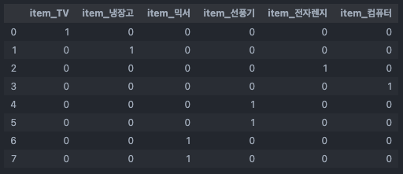

__👋 매일 공부 기록__


## 🥺 20220301

__<알고리즘>__

[깃허브 업로드1](https://github.com/mungdo/mungdo/blob/main/algorithm/special%20lecture/8_%EA%B7%B8%EB%9E%98%ED%94%84%ED%83%90%EC%83%89.py)
[깃허브 업로드2](https://github.com/mungdo/mungdo/blob/main/algorithm/special%20lecture/9_%EA%B7%B8%EB%9E%98%ED%94%84%ED%83%90%EC%83%89_%EB%AC%B8%EC%A0%9C%ED%92%80%EC%9D%B4.py)

[블로그 포스팅](https://mungdo-log.tistory.com/377)

* 그래프 탐색
    * DFS
    * BFS


---

## ⚙️ 20220302

__<머신러닝 : 지도학습 knn(회귀, 분류)>__

[블로그 포스팅:머신러닝 개요](https://mungdo-log.tistory.com/378)

[블로그 포스팅:지도학습](https://mungdo-log.tistory.com/379)

[깃허브 ipynb 파일](https://github.com/mungdo/multicam_ds/tree/main/12_MachineLearning/day1)

* list 형식 데이터 합치기 : `A.extend(B)`
* knn 
  * 모듈 불러오기 : `from sklearn.neighbors import KNeightborsClassifier`
  * 분류 : class 예측
    * `.predict(2차원 형식)` : 예측 결과값
  * 회귀 : 최근접 값의 평균을 결과값으로 예측
  * 훈련 적용 : `.fit(features, lable)`
  * 모델 평가(정확도 = 정확히 맞춘 갯수/전체 데이터 수) : `.score(features, label`
  * k 크기 지정 : `n_neighbors=K 개수` 인자 사용
  * knn 모델이 적용된 변수에 `.fit_X`는 `features`를 의미. `._Y`는 `label`을 의미.
* 모델 검증 - 홀드아웃 방식
  * train : test = 7:3, 9:1 ... 필요에 따라 비율 조정
  * 편향된 데이터 셋 분류 조심. shuffling 해야 함.
  * `from sklearn.model_selection import train_test_split` 모듈 사용
    * `stratify=` 인자 : 층화 표본 추출(class 등 계층 분리가 되어 있는 경우 균일하게 가져와). 초기값(none)은 무작위 표본 추출.
* 기준 맞추기 : 표준화 (Z-Score), 스케일링(scaling)
  * x축과 y축의 기준이 상이할 때, 상대적 거리를 반영하도록 함.
  * `(값 - 평균) / 표준편차` : 평균 0, 표준편차 1인 정규분포로 변환
  * 변환 후에 knn 재실시 하면 상대적인 거리를 반영한 예측 결과 도출
* 이상치 변환 
  * 오른쪽으로 꼬리가 긴 분포 : √x , log(x)
  * 왼쪽으로 꼬리가 긴 분포 : x^2, e^x
  
#
#


__<proDS 강의>__

1. [데이터 전처리](https://mungdo-log.tistory.com/380) : 생성, 정제
2. [확률 개념과 특징](https://mungdo-log.tistory.com/381)

#
#


---

## 🤭 20220303

__<머신러닝 : 지도학습 Decision Tree(회귀, 분류)>__

* dataframe 다루기
  * `apply` 함수 
```python
def label_name(label):
    if label == 0:
        name = iris_Tname[0]
    elif label == 1:
        name = iris_Tname[1]
    elif label == 2:
        name = iris_Tname[2]
    return name

iris_df2['label_name'] = iris_df2.apply(lambda x: label_name(x['label']), axis=1)
iris_df2 # iris_df2에 label_name이라는 column이 추가되어 있음.
```
#
* sklearn.datasets
  * `load_iris` 붓꽃 품종 분류
#
* DT
  * 모듈 불러오기 : `from sklearn.tree import DecisionTreeClassifier`
  * 분류 : label(class) 예측
    * [블로그 정리](https://mungdo-log.tistory.com/382)
  * 회귀 : *아직 수업 전*
#
* 모델 교차 검증 - k-fold 교차 검증
  * kXk개 폴드 세트 나눠서 k번 교차 검증함 
  1. `from sklearn.model_selection import KFold` : 수치 예측 모형에 사용
     * `kfold = KFOLD(n_splits=)`
     * `kfold.split(iris.data)`
     * iterable 객체로 for문 돌려 사용 `for train_index, val_index in kfold.split(iris.data):`
  2. `from sklearn.model_selection import StratifiedKFold`
     * 층화 k겹 교차검증 : 분류 문제 적용시 균열한 샘플링을 위해서 시행
     * `st_kfold = StratifiedKFold(n_splits=)`
     * `for train_index, val_index in st_kfold.split(iris_df, iris_df['label']):` : X, y를 인수로 입력 
     * 교차검증을 보다 간편하게 : `cross_val_score`
       * `score = cross_val_score(모델, X, y, scoring='accuracy', cv=3) `
#
* 교차 검증 + 하이퍼 파라미터(최적의 훈련 모델을 구현하기 위해 모델에 설정하는 변수. k값) 한번에 : `GridSearchCV` 클래스
```python
from sklearn.model_selection import GridSearchCV, train_test_split
from sklearn.tree import DecisionTreeClassifier
from sklearn.metrics import accuracy_score
import pandas as pd

X_train, X_test, y_train, y_test = train_test_split(X, y, test_size = 0.2, random_state=10)
dt_clf = DecisionTreeClassifier()
params = {'max_depth' : [1, 2, 3], 'min_samples_split' : [2, 3]}
grid_tree = GridSearchCV(dt_clf, param_grid=params, scoring='accuracy', cv=3, refit=True, return_train_score=True)

grid_tree.fit(X_train, y_train)
scores_df = pd.Dataframe(grid_tree.cv_results_)

scores_df.columns() # ['mean_fit_time', 'std_fit_time', 'mean_score_time', 'std_score_time', 
                # 'param_max_depth', 'param_min_samples_split', 'params', 'split0_test_score', 
                # 'split1_test_score', 'split2_test_score', 'mean_test_score', 'std_test_score', 
                # 'rank_test_score', 'split0_train_score', 'split1_train_score', 'split2_train_score', 
                # 'mean_train_score', 'std_train_score']

grid_tree.best_params_ # 하이퍼 파라미터

# 최적의 파라미터 적용
best_dt = grid_tree.best_estimator_

# GridSearchCV 객체의 생성 파라미터로 refit=True로 설정된 경우(디폴트)
pred = best_dt.predict(X_test)
accuracy_score(y_test, pred)

```
#
* 예측 정확도 평가 `from sklearn.metrics import accuracy_score`
  * `accuracy_score(test_target, pred)`
#
* 데이터 전처리
  * 데이터 정제
    * 결측값 처리
      * 완전 제거법
      * 수작업으로 채워 넣기 or 특정값 사용
      * 핫덱 대체법 : 동일 조사의 유사한 관측값으로 얻은 자료로 대체
      * 평균값 사용 : 표준오차 과소추정 발생할 수 있음
      * 가능성이 높은 값으로 사용 (회귀분석, 보간법 등)
    * 이상치 처리
    * 잡음 제거
    * 데이터 형식 변환 = [데이터 인코딩](#데이터-인코딩--code-classlanguage-textlabelencodercode) (특정 분석 방법을 사용할 때 필요)
      * 문자열 -> 숫자로 코드화
      * 범주형자료 -> 수치화
  * 데이터 결합 (join)
  * 데이터 변환
    * Normalization (정규화)
    * scaling
  * 차원 축소
    - Feature selection
        - filter
        - wrapper
        - embedded
    - Feature extraction
        - PCA
        - SVD
        - FA
        - NMF

#### 데이터 인코딩 : `LabelEncoder` 

__라벨 인코딩__
```python
from sklearn.preprocessing import LabelEncoder # preprocession : 전처리에 필요한 모듈

items = ['TV', '냉장고', '전자렌지', '컴퓨터', '선풍기', '선풍기', '믹서', '믹서']

encoder = LabelEncoder()
encoder.fit(items)
labels = encoder.transform(items)
labels # array([0, 1, 4, 5, 3, 3, 2, 2])

# 인코딩 전 원래의 값 확인 : encoder.classes_ 속성
encoder.classes_

# 인코딩된 값 디코딩
encoder.inverse_transform([1,4,5,0])
```
#
__원-핫 인코딩__ : 범주형 더미 변수 생성 (해당하는 컬럼에만 1)
1) OneHotEncoder 모듈 사용
```python
from sklearn.preprocessing import OneHotEncoder

# 1. LabelEncoder로 변환 (위에서 완료)
labels # array([0, 1, 4, 5, 3, 3, 2, 2])

# 2. 2차원 데이터로 변환
labels = labels.reshape(-1, 1) # -1 : 모든 행, 1: 열 하나
labels # array([[0],[1],[4],[5],[3],[3],[2],[2]])

# 3. 원-핫 인코딩 적용 
one_encoder = OneHotEncoder()
one_encoder.fit(labels)
one_labels = one_encoder.transform(labels)
print(one_labels) # 공간 절약을 위해서 0 값은 제외하고 보여줌

# 2차원 형태로 출력
one_labels.toarray()
# array([[1., 0., 0., 0., 0., 0.],
#        [0., 1., 0., 0., 0., 0.],
#        [0., 0., 0., 0., 1., 0.],
#        [0., 0., 0., 0., 0., 1.],
#        [0., 0., 0., 1., 0., 0.],
#        [0., 0., 0., 1., 0., 0.],
#        [0., 0., 1., 0., 0., 0.],
#        [0., 0., 1., 0., 0., 0.]])
```
#
2. pandas api `get_dummies()` 메서드 사용
```python
df = pd.DataFrame(items, columns=['item'])

# Pandas 데이터프레임을 NumPy 배열로 변환
pd.get_dummies(df).to_numpy()
# array([[1, 0, 0, 0, 0, 0],
#        [0, 1, 0, 0, 0, 0],
#        [0, 0, 0, 0, 1, 0],
#        [0, 0, 0, 0, 0, 1],
#        [0, 0, 0, 1, 0, 0],
#        [0, 0, 0, 1, 0, 0],
#        [0, 0, 1, 0, 0, 0],
#        [0, 0, 1, 0, 0, 0]], dtype=uint8)

pd.get_dummies(df) # 하단 이미지
```



#
#


*<proDS 강의>*

1. [데이터 전처리 2](https://mungdo-log.tistory.com/380) : 변환, 결합
2. [베이즈 정리](https://mungdo-log.tistory.com/381)


---

## 😵‍💫 20220304

__<머신러닝 순서>__
1. 데이터 전처리 
   1. EDA : 분포 확인
   2. 결측치 처리 : `isnull` `fillna`
   3. 구간화 (binning) 
   4. 인코딩 : 문자열 -> 숫자형으로 변환
   5. (필요 없는 열) 삭제
2. 학습 데이터와 테스트 데이터 분류 `model_selection > train_test_split`
3. 모델을 활용한 학습 `fit` / 예측 `predict` / 평가(정확도) `accuracy_score()`
4. 교차 검증을 통한 모델 성능 향상 `model_selection`
   1. `cross_val_score()` : stratified Kfold 교차검증 빠르게 수행
   2. `GridSearchCV` : 하이퍼 파라미터 튜닝

* 모델 만들기 : `BaseEstimator` 

#

__<평가 지표>__

> 정확도만 사용해 검증해봤는데, 그 외에도 여러 평가 지표가 있음

* 분류 모델의 평가 지표 : 범주형 데이터 예측
  - 정확도(Accuracy)
  - 재현율(Recall)
  - 정밀도(Precision)
  - F1 measure 등 ...

* 회귀 모델의 평가 지표 : 수치형 데이터 예측
  - MSE(Mean Square Error)
  - RMSE(Root Mean Square Error)
  - MAE(Mean Absolute Error)
  - MAPE(Mean Absolute Percentage Error)
  - $ R^2 $

---


## 🤨 20220305

__<알고리즘>__

> 이것이 취업을 위한 코딩테스트다

* 그리디 알고리즘
  * [문자열 뒤집기](https://github.com/mungdo/mungdo/blob/main/algorithm/thisiscodingtest/%EA%B7%B8%EB%A6%AC%EB%94%94/%EB%AC%B8%EC%9E%90%EC%97%B4_%EB%92%A4%EC%A7%91%EA%B8%B0.py)
  * [모험가 길드](https://github.com/mungdo/mungdo/blob/main/algorithm/thisiscodingtest/%EA%B7%B8%EB%A6%AC%EB%94%94/%EB%AA%A8%ED%97%98%EA%B0%80_%EA%B8%B8%EB%93%9C.py)
  * [만들 수 없는 금액](https://github.com/mungdo/mungdo/blob/main/algorithm/thisiscodingtest/%EA%B7%B8%EB%A6%AC%EB%94%94/%EB%A7%8C%EB%93%A4_%EC%88%98_%EC%97%86%EB%8A%94_%EA%B8%88%EC%95%A1.py)

#

---

#

## 🌝 20220307


__<머신러닝 : 분류 모델의 성능 평가 지표>__

|     |          | 예측       | 예측       |
|-----|----------|----------|----------|
|     |          | Positive | Negative |
| 실제  | Positive | TP       | FN       |
| 실제  | Negative | FP       | TN       |

1. 정확도 : `accuracy_score(y_test, pred)`
   * (TP + TN) / (TP + FN + FP + TN)
2. 정밀도 : `precision_score(y_test, pred)`
   * TP / (TP + FN)
3. 재현율 : `recall_score(y_test, pred)`
   * TP / (TP + FP)
4. f1 score : `f1_score(y_test, pred)`
   * 정확도와 재현율의 조화평균
5. G measure : $G = \sqrt{Precision × Recall}$
6. ROC curve : 민감도와 특이도 별 그래프
   * 민감도 : TP / (TP + FP)
   * 특이도 : TN / (FP + TN)
   * 민감도와 특이도 차이가 크다면 올바른 방식이 아님.
   * AUC(ROU curve 아래 면적)가 1에 가까울 수록 좋은 모형.

#
__<머신러닝 : 교차검증>__

> 고정된 학습 데이터와 테스트 데이터로 평가하다보면 과도하게 최적화 될 수 있음(과적합). 이러한 문제를 해결하기 위해서 교차 검증 시행

* `GridSearchCV` : 교차 검증과 최적 하이퍼 파라미터 튜닝을 한번에
  * params (파라미터)를 딕셔너리 형태로 지정
  * cv : 교차 검증 수(k-fold)
  * refit : 최적 파라미터로 재학습 (best_estimator_에 저장되어 있음)
  * 작성 예시
```python
dtree = DecisionTreeClassifier()

params = {'max_depth':[1,2,3], 'min_samples_split':[2,3]}
grid_dtree = GridSearchCV(dtree, param_grid=params, cv=2, refit=True)

grid_dtree.fit(X_train, y_train)

grid_dtree.cv_results_ #결과 전체
grid_dtree.best_params_ #최고 정확도
```
* predict() 함수와 predict_proba() 함수
  * predict() : 각 예측된 값들 반환
  * predict_proba() : 각 예측된 확률 (예를들어 0, 1 이진분류의 경우 각각 0일 확률, 1일 확률) 반환

* 임계값 조정 : 분류 결정 임계값이 낮을수록 positive로 예측할 확률 증가(재현율 증가) <-> 임계값 높을수록 정밀도가 증가
```python
thresholds = [0.3, 0.33, 0.36, 0.39, 0.42, 0.45, 0.48, 0.50]

# predict_proba(X_test)[:, 1] : 이진분류에서 1(positive) 결과 값만 가져오기
pred_proba = lr_clf.predict_proba(X_test)[:, 1].reshape(-1,1) 
get_eval_by_thresholds(y_test, pred_proba, thresholds)

for c in thresholds:
    bina = Binarizer(threshold=c)
    bina.fit(pred_proba)
    pred = bina.transform(pred_proba)
    print('thresholds: ',c)
    # ~ 모델 성능평가 ~
```
# 

---

#

## 💦 20220308

__<머신러닝 : 의사결정나무 Decision Tree>__

* 의사결정나무(DT) 타입 
  * 분류 (범주형 변수 기준으로 나눔. 끝마디의 자료 범주가 결과 값이 됨) `DecisionTreeClassifier`
  * 회귀 (연속형 변수 기준으로 나눔. 끝마디 자료 평균이 회귀 값이 됨) `DecisionTreeRegressor`
* DT에서 중요한 이슈 : 많은 규칙 -> 과적합 가능성 높아짐.
  * __어떻게__ 트리를 분할할 것인가? -> 과적합 방지로 가지치기(pruning) 필요
* 불순도(<-> 균일도)가 낮은(<-> 높은) 데이터 세트를 먼저 선택할 수 있도록
  * 불순도 지표 : 엔트로피 지수, 지니 계수
* DT 피처 중요도 확인 : `feature_importances_` 속성으로 중요도 높은 순으로 확인 가능.
* tree 시각화 
  * `sklearn.tree -> plot_tree` 사용
  * `sklearn.tree -> export_graphviz` 사용해서 .dot 파일로 export 할 수 있음.
```python
export_graphviz(tr_clf, out_file='tree1.dot', class_names=iris_df.target_names, feature_names=iris_df.feature_names, impurity(불순도)=True, filled(노드색상표시)=True)
```

  * `Graphviz` 패키지 사용 : .dot 파일 읽어와서 Source로 보여주기
```python
with open('tree1.dot') as f:
    dot_graph = f.read()

graphviz.Source(dot_graph)

# 생성된 .dot 파일을 .png 파일로 변환해서 저장 후 출력
from subprocess import call

call(['dot', '-Tpng', 'tree1.dot', '-o', 'decision_tree1.png', '-Gdpi=600'])

from IPython.display import Image

Image(filename='decision_tree1.png')
```

* DT 하이퍼 파라미터 튜닝 -> `GridSearchCV` 이용 가능
  * max_depth : 최대 깊이
  * min_samples_split : 노드를 분할하기 위한 최소한의 샘플 데이터수
  * min_samples_leaf : 리프노드가 되기 위해 필요한 최소한의 샘플 데이터수


#

---

#

## 😵 20220309

__<알고리즘 : 그리디>__

* [1이 될 때까지](https://github.com/mungdo/mungdo/blob/main/algorithm/thisiscodingtest/%EA%B7%B8%EB%A6%AC%EB%94%94/1%EC%9D%B4_%EB%90%A0_%EB%95%8C%EA%B9%8C%EC%A7%80.py)
* [곱하기 혹은 더하기](https://github.com/mungdo/mungdo/blob/main/algorithm/thisiscodingtest/%EA%B7%B8%EB%A6%AC%EB%94%94/%EA%B3%B1%ED%95%98%EA%B8%B0_%ED%98%B9%EC%9D%80_%EB%8D%94%ED%95%98%EA%B8%B0.py)
* [볼링공 고르기](https://github.com/mungdo/mungdo/blob/main/algorithm/thisiscodingtest/%EA%B7%B8%EB%A6%AC%EB%94%94/%EB%B3%BC%EB%A7%81%EA%B3%B5_%EA%B3%A0%EB%A5%B4%EA%B8%B0.py)
* [숫자 카드 게임](https://github.com/mungdo/mungdo/blob/main/algorithm/thisiscodingtest/%EA%B7%B8%EB%A6%AC%EB%94%94/%EC%88%AB%EC%9E%90_%EC%B9%B4%EB%93%9C_%EA%B2%8C%EC%9E%84.py)
* [무지의 먹방 라이브 (미완)](https://github.com/mungdo/mungdo/blob/main/algorithm/thisiscodingtest/%EA%B7%B8%EB%A6%AC%EB%94%94/%EB%AC%B4%EC%A7%80%EC%9D%98_%EB%A8%B9%EB%B0%A9_%EB%9D%BC%EC%9D%B4%EB%B8%8C.py)


#

---

#

## 😓 20220310

__<머신러닝 : 앙상블 학습>__

* 앙상블 : 여러 개의 분류기를 사용해서 예측 결합해 보다 정확한 최종 예측 도출
* 앙상블 유형
  * 보팅 : 서로 다른 알고리즘으로 학습시켜 최종적으로 (평균을 내거나 가장 많은 빈도로) 투표해 예측결정을 함
  * 배깅 : 서로 같은 알고리즘으로(데이터 무작위 샘플링으로 표본을 달리하여) 학습시켜 최종적으로 투표해 예측결정을 함 (결정트리 기반)
    * 랜덤 포레스트 : DT가 여러개 있는 것. 하나씩 랜덤하게 뽑아진 DT를 estimator라고 함.
      * 관련 하이퍼 파라미터 : n_estimators, max_features
  * 부스팅 : 오분류된 것에 가중치. 이전의 학습 결과를 이후의 학습에 전달하여 학습 성능 향상을 꽤하는 직렬적 학습 방식을 의미함.
    * AdaBoost
    * 그래디언트 부스팅 (GBM) : 경사하강법(Gradient Descent) 이용 
    * XGB
    * LightGBM
  * 스태깅 : 여러 가지 다른 모델의 예측 결과값을 다시 학습 데이터로 만들어 다른 모델(메타 모델)로 재학습시켜 결과를 예측함

#

---

#

## 🥵 20220311

__<머신러닝 : 회귀분석>__

* OLS 회귀분석 
  * Ordinary Least Square (최소제곱법) : |근사적으로 구하려는 해 - 실제 해| 오차의 제곱근의 합이 최소가 되는 해를 구하는 방법.
  * 종류
    * 단순회귀분석 
    * 다중회귀분석 : 독립변수가 2개 이상
    * 다항회귀분석 : 독립변수가 2차 이상
    * 다변량회귀분석 : 종속변수가 2개 이상

* 선형 회귀 : 실제 값과 예측 값의 차이를 최소화하는 직선형 회귀선을 최적화하는 방식
  * 주요 가정 : 선형성, 정규성, 등분산성, (독립변수간의) 독립성
  * 모델 
    * 일반 선형 회귀
    * _규제_ : 일반적인 선형 회귀의 과적합 문제를 해결하기 위해서 회계 계수에 패널티 값을 적용하는 것
      * 라쏘 : MSE에 L1 규제항을 더함. 가중치를 0으로, 특성 무력화 
      * 릿지 : MSE에 L2 규제항을 더함. 가중치를 0에 가깝게, 특성들의 영향력 감소
      * 엘라스틱넷 : L1, L2 규제를 함께 결합한 모델
    * 로지스틱 회귀 : 분류에서 사용되는 선형 모델

* 경사하강법 : 비용함수(손실함수)가 최소가 되는 지점의 w를 계산 ... _따로 정리 필요_

* 실습
  * [단순 회귀 실습](https://github.com/mungdo/multicam_ds/blob/main/12_MachineLearning/day7/%EB%A8%B8%EC%8B%A0%EB%9F%AC%EB%8B%9D_14_%ED%9A%8C%EA%B7%80(Regression).ipynb)
  * [다항 회귀 실습](https://github.com/mungdo/multicam_ds/blob/main/12_MachineLearning/day7/%EB%A8%B8%EC%8B%A0%EB%9F%AC%EB%8B%9D_15_%EB%8B%A4%ED%95%AD%ED%9A%8C%EA%B7%80.ipynb)


#

---

#

## 🌧 20220312

*<proDS 강의>*

[통계 이론 및 데이터 시각화](https://mungdo-log.tistory.com/381)

* 이항분포
  * 베르누이 시행
  * 포아송 분포
* 연속분포
  * 지수분포
  * 감마분포
  * 정규분포 (가우시안 분포)
    * 표준 정규분포
    * 카이제곱 분포

#

---

#

## ⚙️ 20220313

__<알고리즘 : 구현>__

* [예제4_1_상하좌우](https://github.com/mungdo/mungdo/blob/main/algorithm/thisiscodingtest/%EA%B5%AC%ED%98%84/%EC%98%88%EC%A0%9C4_1_%EC%83%81%ED%95%98%EC%A2%8C%EC%9A%B0.py)
* [예제4_2_시각](https://github.com/mungdo/mungdo/blob/main/algorithm/thisiscodingtest/%EA%B5%AC%ED%98%84/%EC%98%88%EC%A0%9C4_2_%EC%8B%9C%EA%B0%81.py)
* [실전_2_왕실의_나이트](https://github.com/mungdo/mungdo/blob/main/algorithm/thisiscodingtest/%EA%B5%AC%ED%98%84/%EC%8B%A4%EC%A0%84_2_%EC%99%95%EC%8B%A4%EC%9D%98_%EB%82%98%EC%9D%B4%ED%8A%B8.py)
* [실전_3_게임_개발](https://github.com/mungdo/mungdo/blob/main/algorithm/thisiscodingtest/%EA%B5%AC%ED%98%84/%EC%8B%A4%EC%A0%84_3_%EA%B2%8C%EC%9E%84_%EA%B0%9C%EB%B0%9C.py)
* [Q07_럭키_스트레이트](https://github.com/mungdo/mungdo/blob/main/algorithm/thisiscodingtest/%EA%B5%AC%ED%98%84/Q07_%EB%9F%AD%ED%82%A4_%EC%8A%A4%ED%8A%B8%EB%A0%88%EC%9D%B4%ED%8A%B8.py)
* [Q08_문자열_재정렬](https://github.com/mungdo/mungdo/blob/main/algorithm/thisiscodingtest/%EA%B5%AC%ED%98%84/Q08_%EB%AC%B8%EC%9E%90%EC%97%B4_%EC%9E%AC%EC%A0%95%EB%A0%AC.py)
* [Q09_문자열_압축(미완)](https://github.com/mungdo/mungdo/blob/main/algorithm/thisiscodingtest/%EA%B5%AC%ED%98%84/Q09_%EB%AC%B8%EC%9E%90%EC%97%B4_%EC%95%95%EC%B6%95.py)


#

---

#

## 🏊‍ 20220314

__<머신러닝 : 회귀분석>__

* [다항회귀의 과대적합/과소적합]()
  * 과대 적합을 방지하기 위한 모델 -> [규제 선형 모델(ridge, lasso)]()
* [로지스틱 회귀분석]()

#

*<proDS 강의>*

[머신러닝 이론 및 데이터 처리](https://mungdo-log.tistory.com/381)

* 머신러닝 모델 평가 지표
  * 회귀 : MSE, RMSE, R-square, MAE, MAPE
  * 분류 : 정확도, 정밀도, 재현율, roc-auc curve
* 특성 공학
  * 특성 선택 : fillter, wrapper, embeded 등
  * 특성 추출 : 주성분 분석(PCA), 특성값 분해(SVD) 등

#

---

#

## ⛸ 20220315

__<머신러닝 : 차원 축소>__

* [PCA 주성분 분석](https://github.com/mungdo/multicam_ds/blob/main/12_MachineLearning/day9/%EB%A8%B8%EC%8B%A0%EB%9F%AC%EB%8B%9D_22_%EC%B0%A8%EC%9B%90%20%EC%B8%A1%EC%86%8C_PCA_%EC%A3%BC%EC%84%B1%EB%B6%84%20%EB%B6%84%EC%84%9D.ipynb)

#

__<머신러닝 : 비지도학습>__

* [비지도학습 - 군집](https://github.com/mungdo/multicam_ds/blob/main/12_MachineLearning/day9/%EB%A8%B8%EC%8B%A0%EB%9F%AC%EB%8B%9D_23_%EA%B5%B0%EC%A7%91%ED%99%941_K-%ED%8F%89%EA%B7%A0%EC%95%8C%EA%B3%A0%EB%A6%AC%EC%A6%98%EC%9D%B4%ED%95%B4.ipynb)
  * [군집 평가](https://github.com/mungdo/multicam_ds/blob/main/12_MachineLearning/day9/%EB%A8%B8%EC%8B%A0%EB%9F%AC%EB%8B%9D_24_%EA%B5%B0%EC%A7%91%ED%99%942_%EA%B5%B0%EC%A7%91%ED%8F%89%EA%B0%80.ipynb)
  * [평균 이동](https://github.com/mungdo/multicam_ds/blob/main/12_MachineLearning/day9/%EB%A8%B8%EC%8B%A0%EB%9F%AC%EB%8B%9D_25_%EA%B5%B0%EC%A7%91%ED%99%943_%ED%8F%89%EA%B7%A0%EC%9D%B4%EB%8F%99.ipynb)


#

---

#

## 😵‍💫 20220316

> 머신러닝 수료일.. 시험보는날!

__<머신러닝 : 비지도학습 (군집)>__

  * [평균 이동](https://github.com/mungdo/multicam_ds/blob/main/12_MachineLearning/day9/%EB%A8%B8%EC%8B%A0%EB%9F%AC%EB%8B%9D_25_%EA%B5%B0%EC%A7%91%ED%99%943_%ED%8F%89%EA%B7%A0%EC%9D%B4%EB%8F%99.ipynb)
  * [GMM : Gaussian Mixture Model](https://github.com/mungdo/multicam_ds/blob/main/12_MachineLearning/day9/%EB%A8%B8%EC%8B%A0%EB%9F%AC%EB%8B%9D_26_%EA%B5%B0%EC%A7%91%ED%99%944_Gaussian_Mixture_Model.ipynb)
  * [DBSCAN](https://github.com/mungdo/multicam_ds/blob/main/12_MachineLearning/day9/%EB%A8%B8%EC%8B%A0%EB%9F%AC%EB%8B%9D_27_%EA%B5%B0%EC%A7%91%ED%99%945_DBSCAN.ipynb)

#

---

#

## ⛳️ 20220317

> 프로젝트 시작일!

  > 각자 어떤 주제가 좋을지 의견 마구 제시 (브레인스토밍)

  > 해당 주제(혹은 데이터)를 어떻게 발전 시킬지 제시

  > 주제 중에 불가능한 것, 학습 범위에서 벗어 나는 것 소거

  > 2가지 주제로 fix. 데이터 살펴보면서 발전 방향 고민중!

  1. 한국인 신체 치수 데이터를 바탕으로 한국인의 체형 분류 모델 및 사이즈 재정의

  2. 중고차 가격 예측 모델

#

---

#

## 😮‍💨 20220318

> 딥러닝 시작일...!

[딥러닝 이론](https://github.com/mungdo/multicam_ds/blob/main/13_DeepLearning/%EB%94%A5%EB%9F%AC%EB%8B%9D01_%EB%94%A5%EB%9F%AC%EB%8B%9D%EA%B3%BC%20%ED%8D%BC%EC%85%89%ED%8A%B8%EB%A1%A0.ipynb)


#

---

#

## 😍 20220319

*<proDS 강의>*

[머신러닝 이론 및 데이터 처리 : 지도학습](https://mungdo-log.tistory.com/381)

#

---

#

## 🙇‍ 20220320

__<알고리즘>__


#

---

#

## 😵‍💫 20220321 ~ 20220326

> 오미크론이 저에게 왔습니다... 제가 겪어본 가장 아픈 경험이었고 다신 하고싶지 않네요.
> 다들 몸조심하시길 😰


#

---

#

## 🙄 20220327

__<알고리즘 : DFS & BFS>__

- [BFS_예제](https://github.com/mungdo/thisiscodingtest/blob/main/DFS_BFS/%EC%95%88%EB%AC%B8%EC%A3%BC/BFS_%EC%98%88%EC%A0%9C.py)
- [DFS_예제](https://github.com/mungdo/thisiscodingtest/blob/main/DFS_BFS/%EC%95%88%EB%AC%B8%EC%A3%BC/DFS_%EC%98%88%EC%A0%9C.py)
- [Q15_특정_거리의_도시_찾기](https://github.com/mungdo/thisiscodingtest/blob/main/DFS_BFS/%EC%95%88%EB%AC%B8%EC%A3%BC/Q15_%ED%8A%B9%EC%A0%95_%EA%B1%B0%EB%A6%AC%EC%9D%98_%EB%8F%84%EC%8B%9C_%EC%B0%BE%EA%B8%B0.py)
- [Q18_괄호_변환](https://github.com/mungdo/thisiscodingtest/blob/main/DFS_BFS/%EC%95%88%EB%AC%B8%EC%A3%BC/Q18_%EA%B4%84%ED%98%B8_%EB%B3%80%ED%99%98.py)
- [실전문제_3_음료수_얼려_먹기](https://github.com/mungdo/thisiscodingtest/blob/main/DFS_BFS/%EC%95%88%EB%AC%B8%EC%A3%BC/%EC%8B%A4%EC%A0%84%EB%AC%B8%EC%A0%9C_3_%EC%9D%8C%EB%A3%8C%EC%88%98_%EC%96%BC%EB%A0%A4_%EB%A8%B9%EA%B8%B0.py)


```toc
```

