__본 프로젝트는 팀 활동으로 진행 되었고, 프로젝트 상에서 제가 기여한 부분을 중심으로 작성했습니다.__

#
## ⛳️ &nbsp;프로젝트 배경 및 목표
#  


#   
> 코로나 전후 출퇴근 교통 이용자 수, 사무실 공실률 등 다양한 지표를 통해
> 실제 재택근무 변화를 관찰하고자 한다.

---

## 📄  &nbsp;데이터 수집

### 1. 출퇴근 시간대 교통 이용량 변화 분석을 통한 관찰 대상 지역 설정

- [서울시 지하철 선별 역별 승하차 인원 정보 (2018.01~2021.11)](https://data.seoul.go.kr/dataList/OA-12914/S/1/datasetView.do#)

- [서울시 버스노선별 정류장별 시간대별 승하차 인원 정보](http://data.seoul.go.kr/dataList/OA-12913/S/1/datasetView.do#)

- [서울시 역별 일별 시간대별 지하철 승하차 인원 정보](http://www.seoulmetro.co.kr/kr/board.do?menuIdx=551&bbsIdx=2213351)

### 2. 관찰 대상 지역 공실률 분석

- [서울시 오피스빌딩 임대료·공실률 및 수익률 (2013년 이후) 통계](https://data.seoul.go.kr/dataList/10613/S/2/datasetView.do)


---

## 📊  &nbsp;데이터 전처리 및 시각화

### 1. 지하철 요일별, 시간별 변화 살펴보기
#
1. 데이터 : 서울시 역별 일별 시간대별 지하철 승하차 인원 정보
#
2. 데이터 전처리 과정 

    1. 날짜 데이터 Datatime 형태로 변환

    2. datetime.day_name() 함수로 요일 칼럼 추가

    3. 2018~2021년 상이한 인덱스 조정 및 pd.concat() 함수로 합침.

    4. [날짜, 호선, 역번호, 역명, 시간대(6시부터 23시까지), 요일] columns를 가진 csv 파일 완성
#
3. 시각화
    1. 18년 요일별 시간별 히트맵 승객수 (평균) 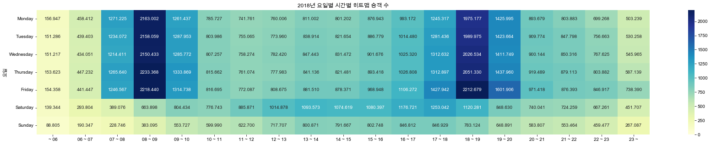 

    2. 19년 요일별 시간별 히트맵 승객수 (평균) 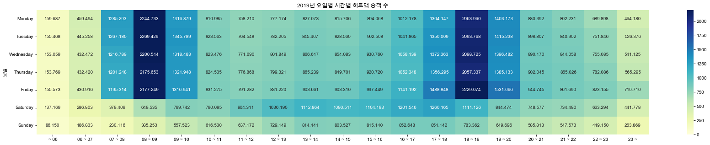

    3. 20년 요일별 시간별 히트맵 승객수 (평균) 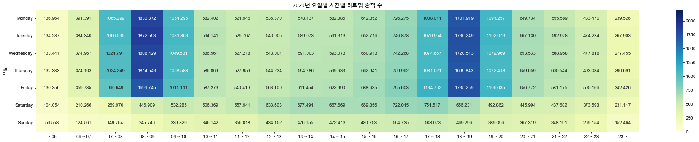

    4. 21년 요일별 시간별 히트맵 승객수 (평균) 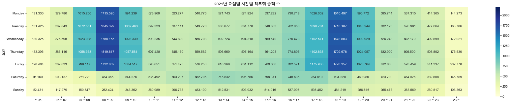

    5. 코로나 이전 (18, 19년) 요일별 시간별 히트맵 승객수 (평균) 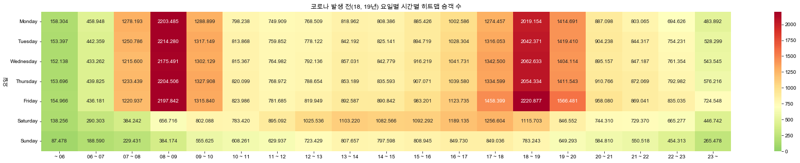

    6. 코로나 이전 (20, 21년) 요일별 시간별 히트맵 승객수 (평균) 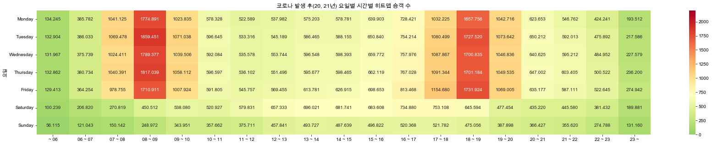

    7. 전체 기간 출근 시간대 (7~10시) 이용객 평균 변화 line chart 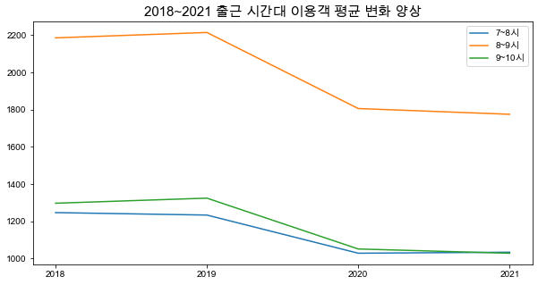

    8. 전체 기간 퇴근 시간대 (17~20시) 이용객 평균 변화 line chart 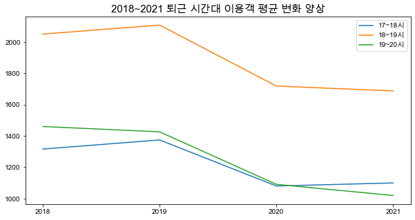
#
#
### 2. 대중교통 총 승객 변화 지도 시각화

1. 데이터 : 서울시 버스노선별 정류장별 시간대별 승하차 인원 정보, 서울시 역별 일별 시간대별 지하철 승하차 인원 정보

2. 데이터 전처리 과정

    1. 지하철 
        1. 코로나 발생 전인 2018년도 이용객수 상위 25%인(quantile() 함수) 지하철 역만 추출. (이용객 다발 구역만 제한해서 시각화 하기 위해)
        2. 해당 지하철 역의 출근시간대 승객수(합계), 퇴근시간대 승객수(합계), 출+퇴근시간 승객수(합계) 계산해 [해당년도, 지하철역, 위도, 경도, 출근, 퇴근, 총계] 컬럼의 csv 완성.

    2. 버스
        1. 각각의 버스 정류장과 가장 가까이 위치한 지하철역 엮어주기 (haversine 모듈로 거리 계산해서 가장 짧은 위치 엮어주기) -> __전체 버스 정류장 데이터__
        2. __전체 버스 정류장 데이터__ 에서 지하철 역과의 거리가 1km 이상인 정류장 제거 (서울 외 지역까지 포함된 버스 정류장이 많아서 서울 지하철 평균 간격 1km로 제한. 90%의 데이터가 1km 이내에 위치한 것을 확인.)
        3. 버스노선별 정류장별 시간대별 승하차 인원 정보 + __전체 버스 정류장 데이터__ : inner join 해서 합산. 정류장 데이터 없는 경우는 제거.
        4. 지하철 역 기준으로 묶어 출근시간대 승객수(합계), 퇴근시간대 승객수(합계), 출+퇴근시간 승객수(합계) 계산해 [해당년도, 지하철역, 위도, 경도, 출근, 퇴근, 총계] 컬럼의 csv 완성.

3. 시각화

    1. 서울시 이동량 지도 전체 (파란 원 : 코로나 이전, 붉은 원 : 코로나 이후) 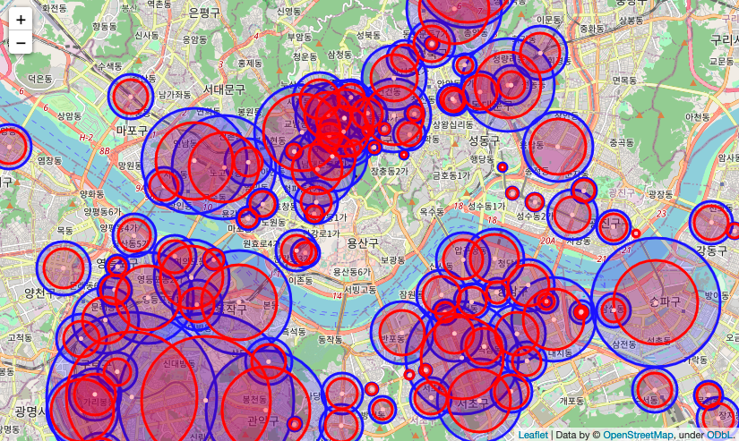

    2. 종로 이동량 지도 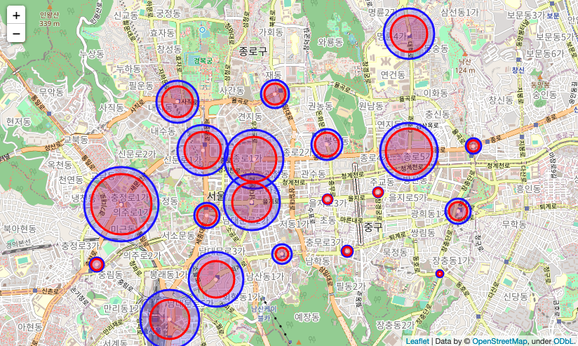

    3. 동작,관악,구로 이동량 지도 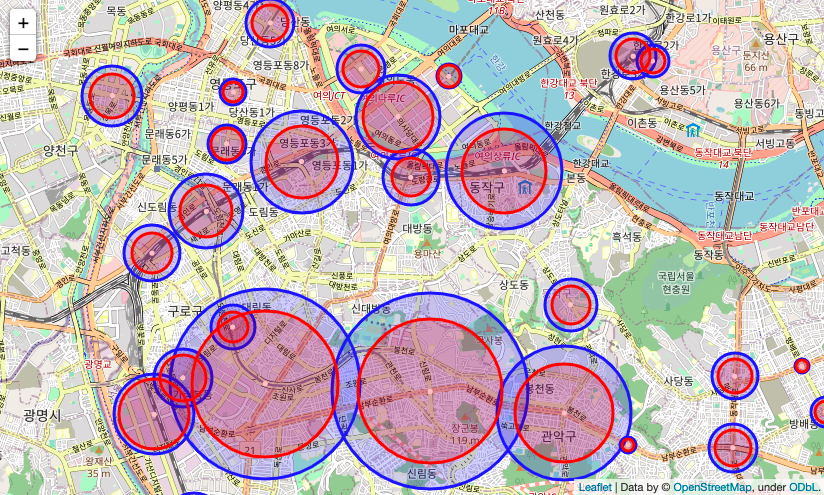

    4. 강남 이동량 지도 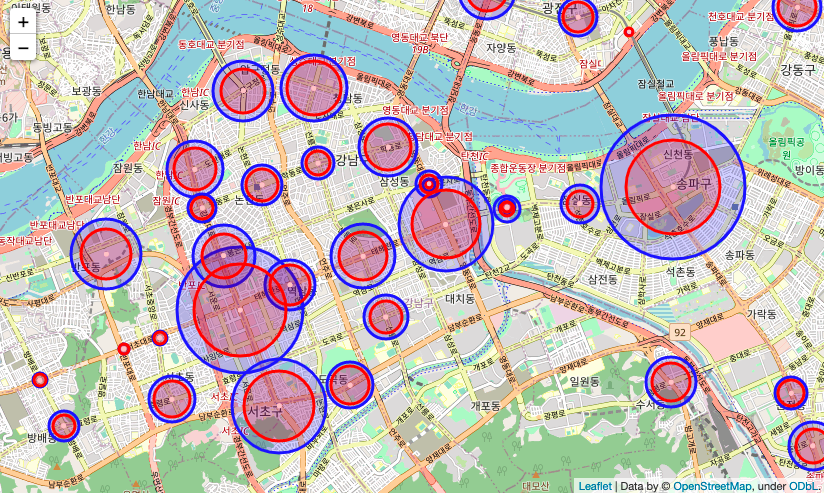

# 
### +. 팀원이 수행한 시각화 목록
1. 버스·지하철 월별 출퇴근 시간 이용자 수
2. 코로나 전(2019년), 후(2020년) 동월대비 대중교통 출퇴근 이용량 비교
3. 출퇴근 시간대 유동인구 지도시각화
4. 사무실 지역 공실률 현황

---

## 👩‍💻  &nbsp;데이터를 보여줄 웹 구현

### 1. Django를 이용한 웹 구현

* 프로젝트 생성 및 settings.py에 app 추가

* index 페이지 생성


### 2. 웹 협업을 위한 깃 환경 구성 : [깃허브 주소](https://github.com/mungdo/heap_pop)

* Readme.md 작성 (협업에 필요한 가이드 내용 작성)

* master 브랜치만 merge 가능하도록 설정하고 merge 진행

### 3. 페이지 생성 후 작업

* [지하철 요일별, 시간별 변화 살펴보기](#1-지하철-요일별-시간별-변화-살펴보기)


* [대중교통 코로나 전 후 총 이동량 지도 시각화](#2-대중교통-총-승객-변화-지도-시각화)


### 4. 발표용 PPT 작성

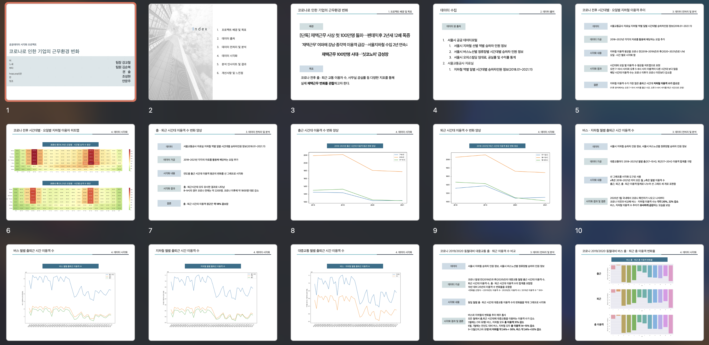
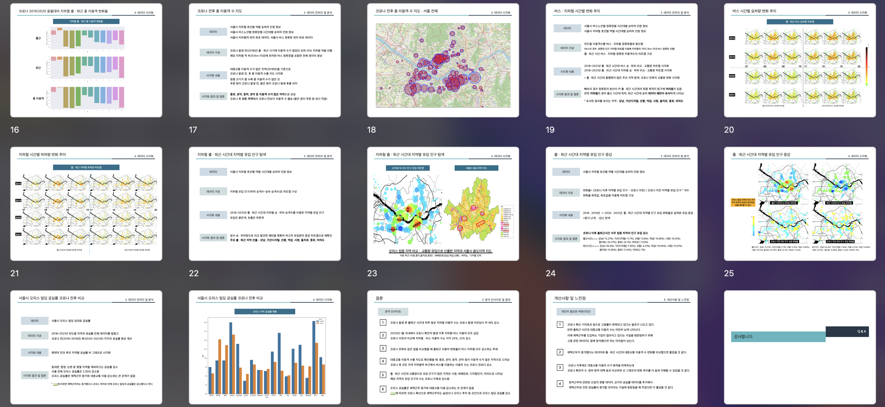


---

## 🏁  &nbsp;분석을 통해 나온 결론


---

## ❗️ &nbsp;개선사항 및 느낀점


```toc
```

