__본 프로젝트는 팀 활동으로 진행 되었고, 프로젝트 상에서 제가 기여한 부분을 중심으로 작성했습니다.__

#
## ⛳️ &nbsp;프로젝트 배경 및 목표
#   

### 1. 배경
> 이전에는 이성적으로 소비를 결정하는 문화가 많았으나 요즘은 감성적인 소비 패턴으로 변화하는 문화를 보여주고 있다.
> 더하여 세일즈포스 2020 마케팅 보고서에서는 마케팅 종사자의 80%는 기업이 제공하는 경험이 중요하다고 응답했다.
> 그래서 많은 회사들이 경험 마케팅을 전개하고 있다. 
> 우리 프로젝트는 이러한 마케팅 분위기에 맞는 기존에 없던 새로운 서점을 만들고자 하였다.

> 기존 인터넷 서점의 경우 단순하게 정보 제공에만 그치고 있다.
> 그렇다면 책을 구매할 때 정보 외에 다양한 경험을 제공할 수는 없을까?

> 그래서 우리는 핵심 소비자층의 감각과 감성을 자극하기 위해 접근성이 높은 노래(청각)과 다양한 연구를 통해 검증된 감정배색(시각)을 활용해서
> 이전에는 존재하지 않았던 경험할 수 있는 새로운 서점을 기획하게 되었다.

### 2. 목표
**소비자의 감성을 자극하는 감성서점 제안**
-> 이후에는 책의 챕터마다 어울리는 배경음악을 제공하는 도서-음악이 연결된 독서 플랫폼을 제공하고자 하는 목표가 있다.

### 3. 프로젝트 주요 기능
- 회원가입과 로그인/로그아웃
- 마이페이지 좋아요 기능
- 도서 페이지에서 배색 팔레트 제공
- 도서 페이지에서 노래 재생
- 새로운 도서 카테고리 추천
- 고객 반응 수집 (리뷰, 노래와 소설 간 어울리는 정도에 대한 반응)

---

## 📄  &nbsp;서비스 개발 과정 : 엔지니어 (요약)

### 1. 시스템 아키텍쳐
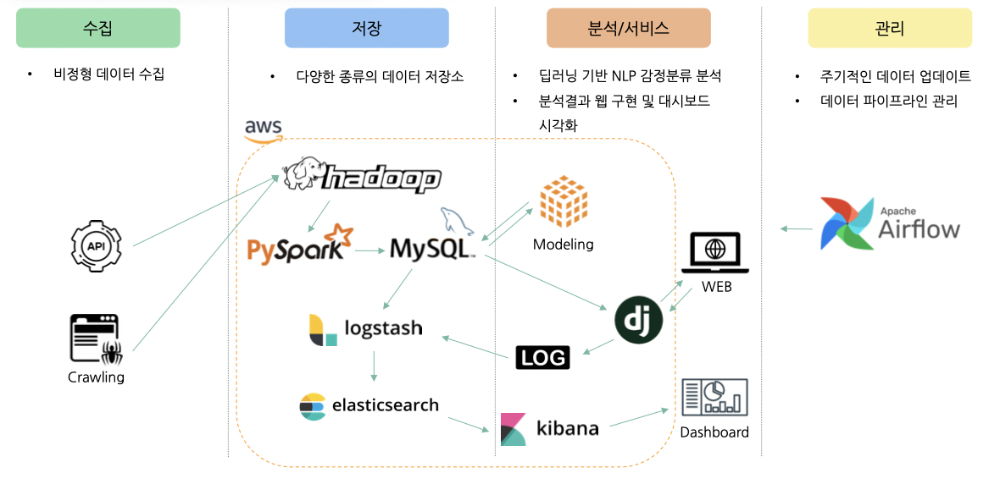

### 2. 데이터 수집
| 데이터 분류 | 출처 | 자료명 | 데이터 건수 | 최초 데이터 수집일 | 자료유형 |
|----|------|-------------|-------|---------|------|
| 소설 | 인터파크 | 인터파크 판매량순 도서 데이터 | 1,118건 | 2022. 04. 16~17 | csv |
| 노래 | 멜론 | 멜론 시대별 차트 데이터 | 981건 | 2022. 04. 16~17 | csv |
| 노래 | 스포티파이 | 음악의 가수, 앨범 정보 데이터 | 981건 | 2022. 04. 20~22 | csv |
| 배색 | 기술표준정보은행 | 감성배색 데이터 | 1,285건 | 2022. 04. 16~17 | json, csv |

**수집 이유**
- 도서 분류 중에서도 소설, 음악에 멜로디가 아닌 가사 데이터를 활용한 이유 
  - 소설이 가장 감성 분석에 적합하다고 판단.
  - 멜로디는 현실적으로 데이터 존재하지 않아서 텍스트 분석을 통해서 초기 버전 만들고 이후 고객 반응 수집으로 멜로디까지 접목할 계획.
- 인터파크, 멜론에서 데이터를 수집한 이유
  - 다양하고 상세한 정보 수집에 용이한 인터파크 활용
  - 대중성 높은 스트리밍 및 다운로드 서비스 1위 멜론 활용
- 배색 데이터 수집 이유
  - 배색에 대해서 느낄 수 있는 감성 언어가 제시되어 있는 데이터로 감정 분류 모델에 적용하기 위함.

### 3. 데이터 적재 및 처리 : hadoop -> pyspark -> mysql
- 차후에 데이터 대량으로 수집하는 경우를 위해 하둡으로 데이터를 받고 스파크로 전처리 후 mysql에 저장

### 4. ERD


### 5. 검색엔진 : mysql -> logstash -> elasticsearch -> django -> web
- 자동 완성 기능을 활용하기 위해 elasticsearch 사용.
  - 합성어 어근만 저장하는 nori_discar를 사용.

### 6. 로그데이터 대시보드 : web -> log -> logstash -> elasticsearch -> kibana -> dashboard
- Django logging module로 수집한 로그를 logstash를 통해 elasticsearch에 'log data' 인덱스로 저장
- 웹서버 로그 데이터 시각화 : 서버 발생 이상 징후나 패턴을 찾아 웹 개선에 활용
- Django에서 의도된 로그를 저장하고 DB에 저장된 회원 데이터를 시각화
  - 사용자 수, 성별, 연령대, 도서 검색 로그 데이터 시각화 등을 통해 마케팅 활용 및 개인화 추천 서비스로 발전 가능

### 7. 프로세스 설계서
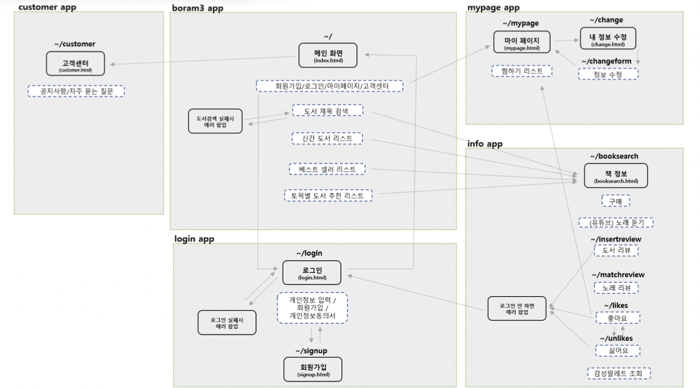


---

## 📊  &nbsp;서비스 개발 과정 : 사이언스

**index**
0. 데이터 EDA
1. 소설 카테고리를 위한 LDA 토픽 모델링
2. 소설, 노래, 배색 연결을 위한 감정 분류 모델
3. cosin 유사도로 소설-노래, 소설-배색 연결

---

### 0. 데이터 EDA

1) 소설 줄거리 및 노래 가사 글자 수 히스토그램
- 소설 단어 빈도수 히스토그램 : 300~600개 글자수 사이가 가장 많았음.

- 노래 가사 단어 빈도수 히스토그램 : 단어수 20~40개인 경우가 가장 많음.


2) 소설 줄거리 및 노래 가사 단어 분포 (상위 25개)
- 소설 단어 개수 빈도 : 단어 개수가 가장 많은 단어들 중 카테고리로 분류하기 어려운 단어 상당수.

- 노래 가사 단어 개수 빈도 : 단어 개수가 가장 많은 단어들 중 노래 분류 작업에 적용하기 어려운 단어 상당수.


3) 소설, 노래 형태소별 단어 빈도수 시각화
- 소설 단어 형태소별 분포 : 명사형이 72.7%로 가장 많은 비율 차지.

- 소설 단어 형태소별 자주 등장하는 단어 (상위 10개)

- 소설 형태소별 Wordcloud

- 노래 가사 단어 형태소별 분포 : 명사형이 61.7%로 가장 많은 비율 차지.

- 노래 가사 단어 형태소별 자주 등장하는 단어 (상위 10개)

- 소설 형태소별 Wordcloud


4) 감성 배색 히스토그램


5) 감성 배색 단어 빈도수 Word Cloud
- 감성배색유사어

- 감성키워드


6) 감정 대화 말뭉치 히스토그램

* Target은 emotion을 0: 기쁨, 1: 불안, 2: 슬픔, 3: 당황, 4: 상처, 5: 분노로 범주형 형태로 할당함.

7) 감정 대화 말뭉치 분류 단어 시각화


---

### 1. 소설 카테고리 분류를 위한 LDA 토픽 모델링

1) 분석 흐름도


2) LDA 분석 개요
- 분석 데이터 : 소설 데이터
  - 줄거리 : 텍스트 분석에서 활용할 데이터 (문자열)
  - 서평 : 텍스트 분석에서 활용할 데이터 (문자열)
  - 책 내용 일부 : 텍스트 분석에서 활용할 데이터 (문자열)
  - 데이터 양 : (레코드 수) 1,118개, (용량) 1.77MB
- LDA 
  - 추출한 문서에 담긴 단어들의 주제(토픽)을 추출하는 ‘토픽모델링’ 기법 중 하나인 「잠재디리클레할당」 방법론 
  - LDA는 각 문서의 토픽 분포와 각 토픽 내의 단어 분포를 추정 
  - 추출한 원문에는 다양한 내용이 담겨 있을 수 있는데 이러한 주제들을 일일이 수작업으로 분류하기 어렵기 때문에 LDA 같은 분류 방법을 적용해 전반적인 데이터의 구조를 먼저 파악할 수 있음 
  - LDA 기법은 단순히 주제만 분류하는 것이 아니라 주제에 포함되는 키워드를 보여주기 때문에 그 키워드들로 해당 주제를 해석하고 정의할 수 있음

3) 전처리 : 형태소 분리 및 불용어 처리 
- Konlpy (한국어 정보처리를 위한 파이썬 패키지) 형태소 분리 모듈 사용 
  - OKT : 오픈소스 한국어 분석기. 과거 트위터 형태소 분석기.
  - 한나눔 (Hannanum) : KAIST Semantic Web Research Center 개발.
  - 꼬꼬마 (kkma) : 서울대학교 IDS(Intelligent Data Systems) 연구실 개발.
  - Komoran : Shineware 개발.
  - MeCab : 일본어용 형태소 분석기를 한국어를 사용할 수 있도록 수정.
- 전처리 수행 : OKT 채택


4) 성능 개선 : 성능 평가 및 최적의 토픽 개수 채택
- LDA 성능 평가 지표 : Coherence Score (응집성 지수, c_v).
  - genism.models.coherencemodel 사용
  - 주제 모델에 대한 주제 일관성 계산.
  - 파라미터
    - model : 사전 훈련된 주제 모델. LdaMallet 사용. 
    - texts : 형태소 분리된 줄거리 / 서평 / 내용 일부 사용 
    - coherence : c_v 사용
- 성능 평가 과정 요약
  1. 단어를 정수 인코딩 값으로 변환 : gensim.corpora.dictionary
  2. 5회 이하로 발생한 값 제거 : dictionary class에서 filter_extremes(no_below = 5) 
  3. LDA 토픽 분석 진행 : gensim.models.wrappers.LdaMallet
  4. 응집성 지수 값 계산 : CoherenceModel
  - 줄거리, 서평, 책 내용 여러 조합으로 데이터 바꿔가며, 토픽 개수 4~18개로 바꿔가며 유사성 점수 계산  
- 데이터 조합 별 유사성 점수 시각화 : 책 소개 + 서평 조합과 10개 군집 채택


5) 결과
- 시각화에 사용한 모듈 : pyLDAvis.gensim_models 이용

  - 일부 군집에서 겹치는 모습으로 보임
  - 각각 분류의 단어를 확인하며 군집의 내용이 모두 상이한 것을 확인
- 최종 분류된 토픽별 키워드 

- 최종 소설 테이블 일부


---

### 2. 소설-노래-감성배색을 연결하기 위한 감성 분류 모델 구축

1) 감성 분류 모델 개요
- AI Hub 감성 대화 말뭉치
  - 대화 응답 시나리오를 동반한 감성 텍스트 언어
  - 감정대분류 : 0:기쁨, 1:불안, 2:슬픔, 3:당황, 4:상처, 5:분노
  - 사람 응답 문장만 활용
- 분석 방법 : 사전 훈련된 NLP 모델 4가지를 활용한 전이학습
  - 4가지의 언어모델은 스스로 라벨링을 하는 준지도 학습
  - 전이학습을 통해서 라벨이 주어지는 지도학습으로 전환
    - 각각 언어모델에 NLP Task를 위한 추가적인 모델을 쌓아 이를 통해 분석하고자 하는 감정 분류 모델을 생성

2) 활용한 사전 훈련 모델

| 모델명 | 설명 요약                                             | 
|------|---------------------------------------------------|
| [Bert](https://github.com/SKTBrain/KoBERT) | 구글에서 2018년 개발한 NLP(자연어처리) 사전 훈련 기술                |
| [Albert](https://github.com/google-research/albert) | Bert 모델에서 파라미터의 개수를 감소시켜 학습시간을 단축한 기술             |
| [Roberta](https://github.com/facebookresearch/fairseq/blob/main/examples/roberta/README.md) | Bert 모델에서 학습단계의 hyper parameter들을 조정하여 성능을 높이는 방법 |
| [KoElectra](https://github.com/Beomi/KoELECTRA) | 구글에서 2020년 개발한 NLP 사전 훈련 기술 (bert 보다 빠른 성능)       |

  1. Bert : generator에서 나온 token을 보고 discriminator에서 "real" token인지 "fake" token인지 판별하는 방법으로 학습성능을 테스트
     - BERT는 Bidirectional(양방향) Encoder(문자를 숫자로 바꿔주는) Representations from Transformers의 약자이며 오픈소스로 공개된 구글의 Language Representation Model임
     - 단어를 하나씩 읽어가면서 다음 단어를 예측하는 일방향 모델인 GPT-1 모델의 문장처리의 한계를 극복하기 위해 탄생됨 - 한 두 문장의 학습데이터를 통해서 토큰 간의 상관관계와 문장 간의 상관관계를 학습하게 됨

  2. Albert
     - ALBERT는 사전 훈련된 모델을 확장하는 데 있어 주요 장애물을 제거하는 두가지 매개변수 감소 기술을 통합함
     - 두 기술 모두 성능을 심각하게 저하시키지 않으면서 BERT에 대한 매개변수 수를 크게 줄여 매개변수 효율성을 개선함

  3. Roberta
     - self-Supervised 기반의 학습 방식은 Pre-training에서 많은 시간/리소스가 소요되기 때문에 BERT 및 이후 접근법들을 엄밀하게 비교하기 힘들고, 어떤 Hyper Parameter가 결과에 많은 영향을 미쳤는지 검증하기 힘듦.
     - BERT는 아직 Undertrain되어 있고, Pre-training 과정에서 Hyper-parameter의 튜닝으로 더 좋은 결과를 얻을 수 있음
     - BERT에 비해 더 많은 데이터로 더 오래, 더 큰 배치로 학습을 진행함.
     * 전이학습 과정에서 프리즈를 328, 329개로 각각 설정해 2가지 모델로 만들었음.

  4. Koelectra
     - ICLR 2020에서 구글 리서치 팀은 새로운 pre-training 기법을 적용한 language model, ELECTRA (Efficiently Learning an Encoder that Classifies Token Replacements Accurately)를 발표
     - 기존 BERT를 비롯한 많은 language model들은 입력을 마스크 토큰으로 치환하고 이를 치환 전의 원본 토큰으로 복원하는 masked language modeling 태스크를 통해 pre-training 진행
     - ELECTRA는 Replaced Token Detection, 즉 generator에서 나온 token을 보고 discriminator에서 "real" token인지 "fake" token인지 판별하는 방법으로 학습

3) 감성 분류 모델 과정
- 분석 흐름도
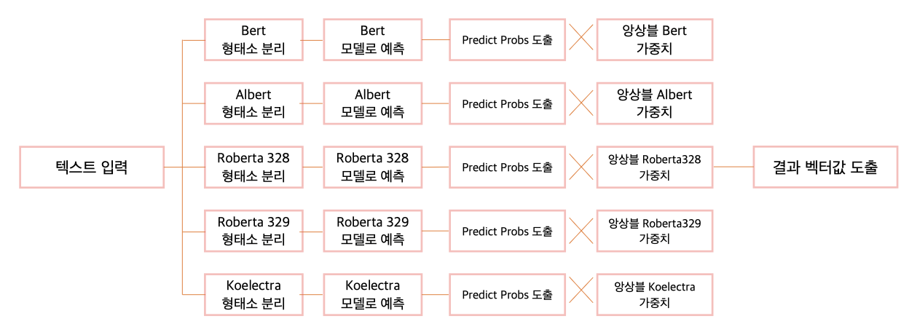

4) 각 사전 훈련 모델 예측 결과
- 모델별 정확도

| 모델명                                                                                        | 정확도  | 
|--------------------------------------------------------------------------------------------|------|
| [Bert](https://github.com/SKTBrain/KoBERT)                                                 | 0.47 |
| [Albert](https://github.com/google-research/albert)                                        | 0.52 |
| [Roberta](https://github.com/facebookresearch/fairseq/blob/main/examples/roberta/README.md) | 0.53 |
| [Roberta](https://github.com/facebookresearch/fairseq/blob/main/examples/roberta/README.md) | 0.53 |
| [KoElectra](https://github.com/Beomi/KoELECTRA)                                            | 0.51 |

5) 모델 앙상블로 가중치 결정
- 0~1 사이 값을 조정하며 모든 모델의 정확도를 계산해서 정확도가 가장 높은 가중치 채택.
- 0.075*bert + 0.3*albert + 0.05*koelectra + 0.15*roberta328 + 0.425*roberta329
  - 최종 정확도 0.55 (2% 상향)

6) 최종 벡터 생성 결과
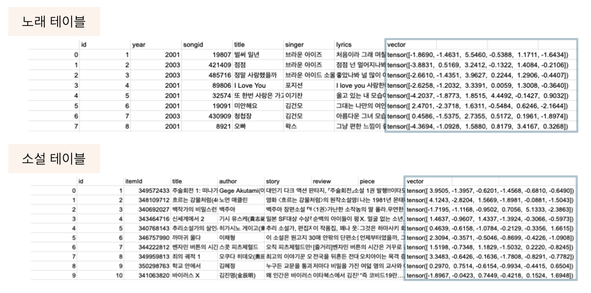
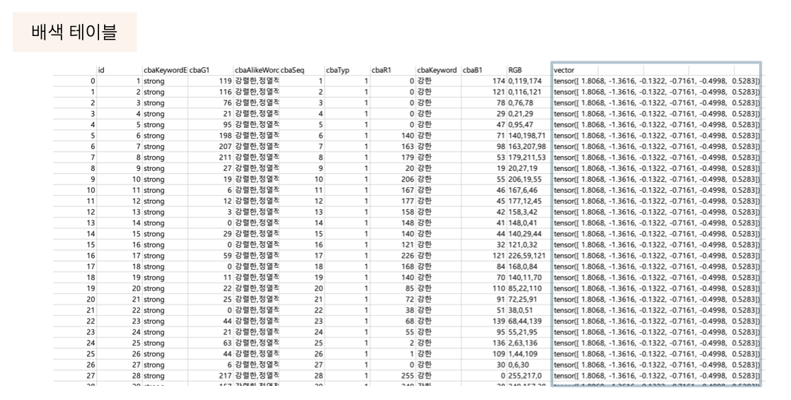

---

### 3. 감성 분류 벡터 유사도 계산으로 소설-노래, 소설-배색 연결

- 분석 데이터
  - 소설 데이터 : 소설 줄거리 + 서평 + 책 내용 일부를 바탕으로 추출한 감정분류 벡터
  - 노래 데이터 : 노래 가사를 바탕으로 추출한 감정분류 벡터
  - 감성배색 데이터 : 감성배색 단어들을 바탕으로 추출한 감정분류 벡터
- 분석 방법 : 코사인 유사도 계산(내적 공간 두 벡터간 각도의 코사인 값을 이용해 측정된 벡터간의 유사한 정도)
  - 소설 하나와 노래(배색) 전체에 대한 코사인 유사도 계산
  - 유사도 점수가 가장 높은 20개 목록 저장
  - 소설 전체에 위 과정을 반복하며 테이블로 저장
  
---

## 👩‍💻  &nbsp;분석 내용 서비스 반영

* 서비스 플로우
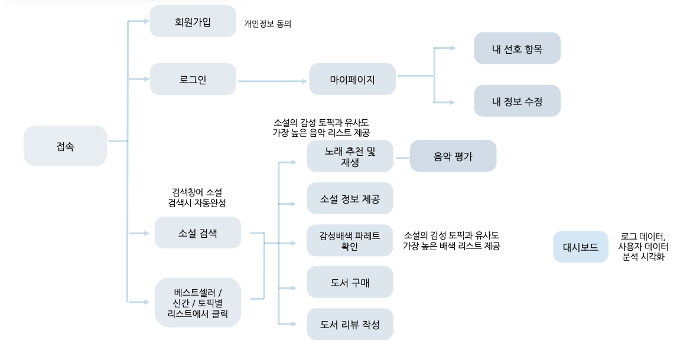

- 메인 페이지
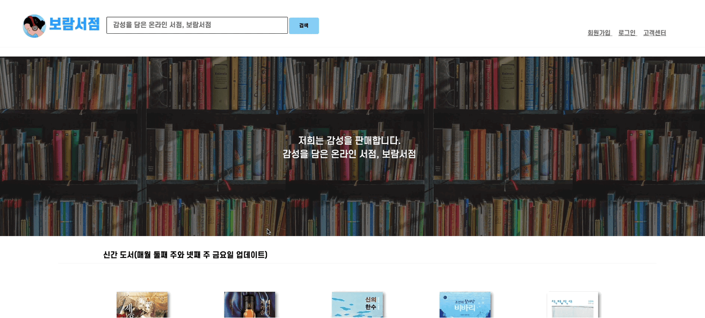
- (메인 페이지) LDA 분석 결과로 새롭게 제시하는 카테고리 제안

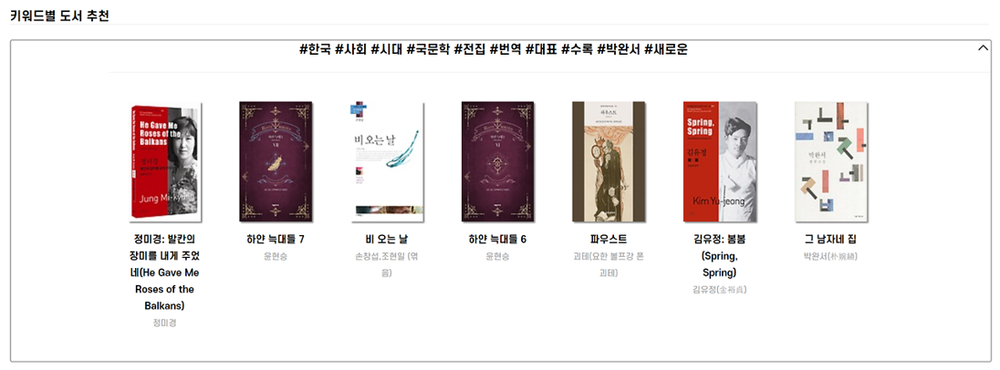

- 책 검색 결과 페이지
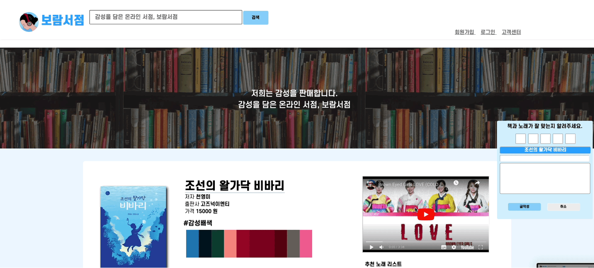
  - 해당 책과 유사한 감성의 배색 하단에 제시
  - 해당 책과 유사한 감성의 노래 우측에 제시

- 로그인 및 회원가입
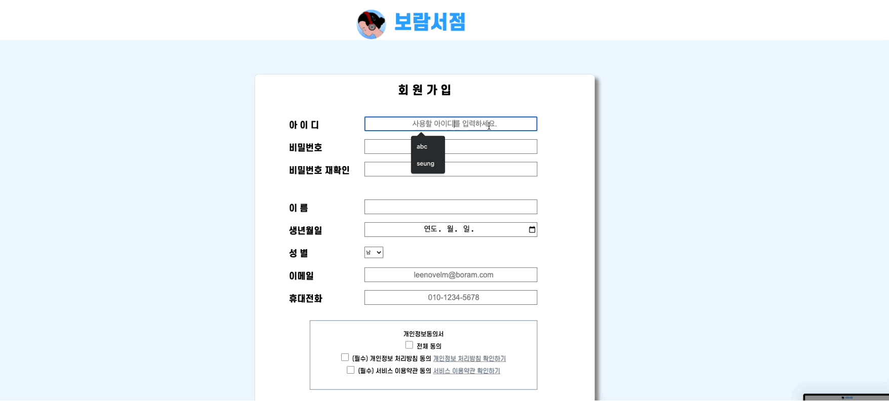

- 마이페이지
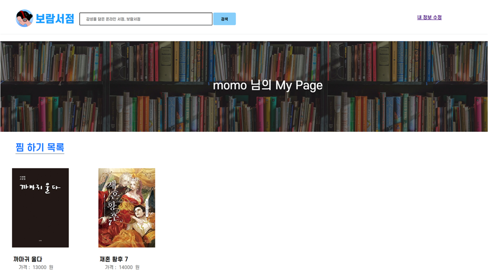

- 고객 센터
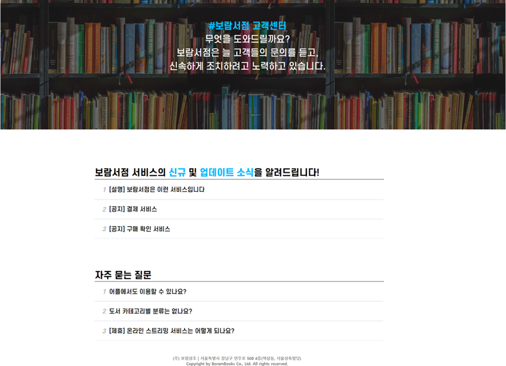

---

## 📢  &nbsp;발표용 PPT 및 분석 보고서 작성

[발표용 PPT](https://drive.google.com/file/d/1LHOALW7NWt3XrvVpeIKssfrfEFpL6_O6/view?usp=sharing)
[분석 보고서](https://drive.google.com/file/d/1otSDO7fTI7kTubisXNKTRUdV51fgQpKk/view?usp=sharing)

---

## ⌨️  &nbsp;코드 공유

[깃허브-웹페이지 코드](https://github.com/mungdo/boram3_open)

---

## 🏁  &nbsp;분석을 통해 나온 결론 및 개선점

### 결론
1. 소설 내용을 기반으로 새로운 카테고리 제시
- LDA 토픽 분류시 책소개 + 서평을 합친 경우이면서 10개 군집인 경우가 최적의 유사성 점수를 보임(42%)
2. 4가지 NLP 사전 훈련 기술을 바탕으로 감정분류모델 생성
- 모델별 정확도는 47~53% 사이의 결과가 나옴.
- 문장을 입력하면 감정 별로 예측 확률이 벡터 형식으로 도출됨.
3. 벡터간의 코사인 유사도를 활용해 소설과 노래, 소설과 배색을 연결하는 새로운 연결점을 도출함
- 이전에 존재하지 않았던 내용 기반 연결점을 도출함.

### 개선점
1. 감정 분류 모델 구현을 위해 우울증 관련 대화 말뭉치를 기반으로 분석 진행됨
- 설명문 혹은 구어체 표현에 대한 감정분류 데이터 기반 분석 필요 
- 추후 이미지 및 동영상 데이터 등과 같은 비정형 데이터를 계량화하여 새로운 정보 원천으로 활용 필요
2. LDA Topic Modeling를 통한 Topic 추천 서비스를 구현하기 위해 매번 새로 갱신되는 형식으로 비효율성 초래 
- 정확한 Topic Modeling를 통해 지속해서 불용어 처리 필요
- LDA에서 정확하게 Topic이 분리되는 경우 빈도수 기반으로 알맞는 분류에 편입 가능
3. 앙상블 모델을 통해서 추천 서비스를 구현하기 위해 모델 정확도 개선 필요
- 추가적인 가중치 부여 필요
- 학습 시간 연장 필요
4. 서비스 구현시 단순 국내 소설 기본 정보 기반으로만 국한해서 분석 진행
- 서비스 확대시 국내소설 뿐만 아니라 다른 장르도 포함하여 분석 진행 필요 
- 서적 전체 내용 기반으로 분석을 진행하여 전체적인 책의 분위기 구현 가능

---

국비지원 교육 과정의 마지막 프로젝트를 마쳤습니다.
마치 하나의 사업을 구상하듯이 주제를 선정했습니다. 6주간 기간에서 2주동안 전에 없던 새로운 아이템을 기획해보고자 했고 위와 같은 결과가 나왔습니다.
물론 아직은 현실화 하기 어려운 초기 사업 주제가 될 것 같지만, 전에 없던 것을 제시했다는 것에 큰 의의를 두고 시작했습니다.
강사님께서도 이 주제에 대해서 계속 의문을 품고 다양한 방면의 제안을 해주셨는데 우리 팀의 의견을 지켜가며 잘 완성한 것 같습니다.

데이터 사이언스 부문에서 특히 윤곽을 잡기가 어려웠기 때문에 초기에는 소설 LDA, 노래 LDA를 진행하고 둘을 묶어주는 방식을 생각했지만 원하는 대로 진행되지 않았습니다.
노래가 생각보다 정확하게 군집이 나눠지지 않아서 연결 지점을 찾기가 어려웠는데요.
두 지점을 합칠 수 있는 다양한 방안을 생각하고 결국 감성사전을 만들어서 감정 분류를 해보자에서 시작해서 진행하였습니다.
물론 사실 해당 소설 내용과 노래 가사가 정확히 연결되기는 어려움이 있었습니다.
정확도도 높지 않을 뿐더러 감정 벡터를 바탕으로 해당 내용이 유사하다는 검증을 할 수 없다는 것도 알고 있습니다.
하지만 어느정도 감성이 일치하는 부분이 있다면 책을 구매하는 사람들에게 노래를 함께 제시한다는 사실 자체가 구매 동기 부여에 조금은 좋은 영향을 미치지 않을까 생각했습니다.
실제로 사업화가 되면 어떨지 궁금합니다 🤔 같은 주제로 더 좋은 분석방법이 있다면 많이 제언해주세요! (댓글 부탁드려요~)

사실 이번 팀 활동은 많은 수난이 있었습니다.
장기전이기도 했고, 팀원들의 합이 많이 중요하다고 생각한 시기였습니다. 
하지만 끝까지 함께 했고 결과적으로 우수상도 받게되어 너무 기뻤습니다.
몇몇 팀원들의 열의가 없었다면 이뤄지지 않았을 결과라고 생각해 너무 감사합니다. 😆
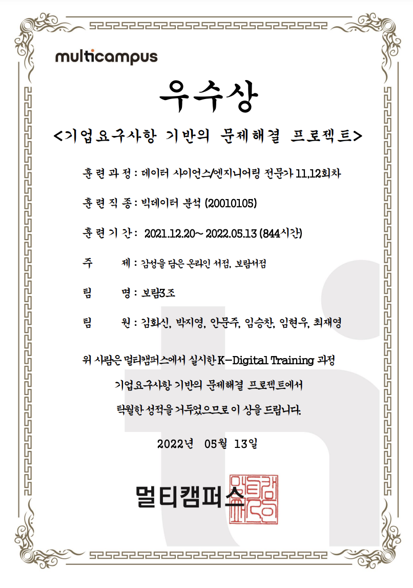

텍스트 분석. 특히 전이학습 부분을 처음 시도해보며 다양한 방법론에 대한 공부를 하게 되어 좋은 경험이었습니다.
다양한 토이 프로젝트를 하면서 더 발전하겠습니다. 읽어주셔서 감사합니다 :)


```toc
```

