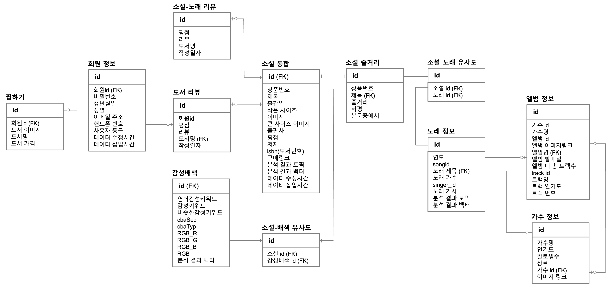

__본 프로젝트는 팀 활동으로 진행 되었고, 프로젝트 상에서 제가 기여한 부분을 중심으로 작성했습니다.__

#
## ⛳️ &nbsp;프로젝트 배경 및 목표
#   

### 1. 배경
> 이전에는 이성적으로 소비를 결정하는 문화가 많았으나 요즘은 감성적인 소비 패턴으로 변화하는 문화를 보여주고 있다.
> 더하여 세일즈포스 2020 마케팅 보고서에서는 마케팅 종사자의 80%는 기업이 제공하는 경험이 중요하다고 응답했다.
> 그래서 많은 회사들이 경험 마케팅을 전개하고 있다. 
> 우리 프로젝트는 이러한 마케팅 분위기에 맞는 기존에 없던 새로운 서점을 만들고자 하였다.

> 기존 인터넷 서점의 경우 단순하게 정보 제공에만 그치고 있다.
> 그렇다면 책을 구매할 때 정보 외에 다양한 경험을 제공할 수는 없을까?

> 그래서 우리는 핵심 소비자층의 감각과 감성을 자극하기 위해 접근성이 높은 노래(청각)과 다양한 연구를 통해 검증된 감정배색(시각)을 활용해서
> 이전에는 존재하지 않았던 경험할 수 있는 새로운 서점을 기획하게 되었다.

### 2. 목표
**소비자의 감성을 자극하는 감성서점 제안**
-> 이후에는 책의 챕터마다 어울리는 배경음악을 제공하는 도서-음악이 연결된 독서 플랫폼을 제공하고자 하는 목표가 있다.

### 3. 프로젝트 주요 기능
- 회원가입과 로그인/로그아웃
- 마이페이지 좋아요 기능
- 도서 페이지에서 배색 팔레트 제공
- 도서 페이지에서 노래 재생
- 새로운 도서 카테고리 추천
- 고객 반응 수집 (리뷰, 노래와 소설 간 어울리는 정도에 대한 반응)

---

## 📄  &nbsp;서비스 개발 과정 : 엔지니어 (요약)

### 1. 시스템 아키텍쳐


### 2. 데이터 수집
| 데이터 분류 | 출처 | 자료명 | 데이터 건수 | 최초 데이터 수집일 | 자료유형 |
|----|------|-------------|-------|---------|------|
| 소설 | 인터파크 | 인터파크 판매량순 도서 데이터 | 1,118건 | 2022. 04. 16~17 | csv |
| 노래 | 멜론 | 멜론 시대별 차트 데이터 | 981건 | 2022. 04. 16~17 | csv |
| 노래 | 스포티파이 | 음악의 가수, 앨범 정보 데이터 | 981건 | 2022. 04. 20~22 | csv |
| 배색 | 기술표준정보은행 | 감성배색 데이터 | 1,285건 | 2022. 04. 16~17 | json, csv |

**수집 이유**
- 도서 분류 중에서도 소설, 음악에 멜로디가 아닌 가사 데이터를 활용한 이유 
  - 소설이 가장 감성 분석에 적합하다고 판단.
  - 멜로디는 현실적으로 데이터 존재하지 않아서 텍스트 분석을 통해서 초기 버전 만들고 이후 고객 반응 수집으로 멜로디까지 접목할 계획.
- 인터파크, 멜론에서 데이터를 수집한 이유
  - 다양하고 상세한 정보 수집에 용이한 인터파크 활용
  - 대중성 높은 스트리밍 및 다운로드 서비스 1위 멜론 활용
- 배색 데이터 수집 이유
  - 배색에 대해서 느낄 수 있는 감성 언어가 제시되어 있는 데이터로 감정 분류 모델에 적용하기 위함.

### 3. 데이터 적재 및 처리 : hadoop -> pyspark -> mysql
- 차후에 데이터 대량으로 수집하는 경우를 위해 하둡으로 데이터를 받고 스파크로 전처리 후 mysql에 저장

### 4. ERD


### 5. 검색엔진 : mysql -> logstash -> elasticsearch -> django -> web
- 자동 완성 기능을 활용하기 위해 elasticsearch 사용.
  - 합성어 어근만 저장하는 nori_discar를 사용.

### 6. 로그데이터 대시보드 : web -> log -> logstash -> elasticsearch -> kibana -> dashboard
- Django logging module로 수집한 로그를 logstash를 통해 elasticsearch에 'log data' 인덱스로 저장
- 웹서버 로그 데이터 시각화 : 서버 발생 이상 징후나 패턴을 찾아 웹 개선에 활용
- Django에서 의도된 로그를 저장하고 DB에 저장된 회원 데이터를 시각화
  - 사용자 수, 성별, 연령대, 도서 검색 로그 데이터 시각화 등을 통해 마케팅 활용 및 개인화 추천 서비스로 발전 가능

### 7. 프로세스 설계서


---

## 📊  &nbsp;서비스 개발 과정 : 사이언스

**index**
0. 데이터 EDA
1. 소설 카테고리를 위한 LDA 토픽 모델링
2. 소설, 노래, 배색 연결을 위한 감정 분류 모델
3. cosin 유사도로 소설-노래, 소설-배색 연결

---

### 0. 데이터 EDA

1) 소설 줄거리 및 노래 가사 글자 수 히스토그램
- 소설 단어 빈도수 히스토그램 : 300~600개 글자수 사이가 가장 많았음.

- 노래 가사 단어 빈도수 히스토그램 : 단어수 20~40개인 경우가 가장 많음.


2) 소설 줄거리 및 노래 가사 단어 분포 (상위 25개)
- 소설 단어 개수 빈도 : 단어 개수가 가장 많은 단어들 중 카테고리로 분류하기 어려운 단어 상당수.

- 노래 가사 단어 개수 빈도 : 단어 개수가 가장 많은 단어들 중 노래 분류 작업에 적용하기 어려운 단어 상당수.


3) 소설, 노래 형태소별 단어 빈도수 시각화
- 소설 단어 형태소별 분포 : 명사형이 72.7%로 가장 많은 비율 차지.

- 소설 단어 형태소별 자주 등장하는 단어 (상위 10개)

- 소설 형태소별 Wordcloud

- 노래 가사 단어 형태소별 분포 : 명사형이 61.7%로 가장 많은 비율 차지.

- 노래 가사 단어 형태소별 자주 등장하는 단어 (상위 10개)

- 소설 형태소별 Wordcloud


4) 감성 배색 히스토그램


5) 감성 배색 단어 빈도수 Word Cloud
- 감성배색유사어

- 감성키워드


6) 감정 대화 말뭉치 히스토그램

* Target은 emotion을 0: 기쁨, 1: 불안, 2: 슬픔, 3: 당황, 4: 상처, 5: 분노로 범주형 형태로 할당함.

7) 감정 대화 말뭉치 분류 단어 시각화


---

### 1. 소설 카테고리 분류를 위한 LDA 토픽 모델링

1) 분석 흐름
- 분석 목적 및 환경 정의
- 분석용 데이터 전처리 및 EDA
- LDA 기반 Topic Modeling
- 모델 성능 평가 및 개선

2) 분석 데이터 설명
- 소설 줄거리
  - 줄거리 : 텍스트 분석에서 활용할 데이터 (문자열)
  - 서평 : 텍스트 분석에서 활용할 데이터 (문자열)
  - 책 내용 일부 : 텍스트 분석에서 활용할 데이터 (문자열)
  - 데이터 양 : (레코드 수) 1,118개, (용량) 1.77MB
  
3) 전처리
4) LDA 모델링
5) 결과


---

## 👩‍💻  &nbsp;데이터를 보여줄 웹 구현


---

## 🏁  &nbsp;분석을 통해 나온 결론


---

## ❗️ &nbsp;개선사항 및 느낀점


---


```toc
```

