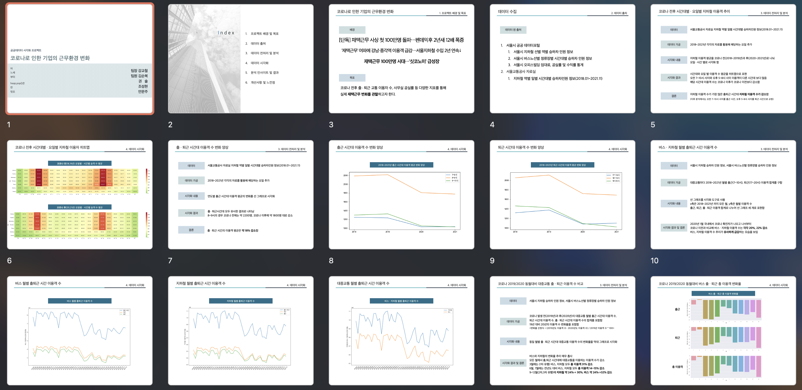

__본 프로젝트는 팀 활동으로 진행 되었고, 프로젝트 상에서 제가 기여한 부분을 중심으로 작성했습니다.__

#
## ⛳️ &nbsp;프로젝트 배경 및 목표
#  

대졸자 집단의 실업률이 높은 상황. 해당 그래프를 보면 2019년 대졸자의 취업비율은 73.8%에서 2020년 조사 당시 66.4%로 하락한 모습을 볼 수 있습니다.
   


이런 청년층 취업난의 심화에 한국고용정보원은 위와 같은 8개의 원인을 제시했습니다. 이번 프로젝트에서 저희가 주목한 것은 7번 대졸자 노동시장에 대한 잘못된 정보와 8번 구직의욕 상실자인 청년 NEET의 증가입니다.
그래서 이번 프로젝트를 통해 대졸자 구직에 영향을 미치는 요소들은 어떤 것이 있는지 알아보고 구직자 상황을 반영한 정보를 제공하고자 합니다.
   

### 기획 목표
1. 취업 여부를 결정하는 변수 알아보기
2. 종사상 지위 구분(정규직, 비정규직, 프리랜서 등)을 결정하는 변수 알아보기
3. 기업체 구분(국내 사기업, 공기업, 외국계 기업 등)을 결정하는 변수 알아보기

   


#   
> 

---

## 📄  &nbsp;데이터 

### 대졸자 직업이동경로조사
> GOMS : Graduates Occupational Mobility Survey
  
[GOMS 조사개요](https://survey.keis.or.kr/goms/goms01.jsp)
  
  
전국의 전문대학 및 대학교 졸업자의 3~4%를 선정하여 대학 졸업자의 경력개발 및 직업(직장) 이동경로를 조사한 내용입니다.

- [데이터(2016~2018)](https://survey.keis.or.kr/goms/gomsdownload/List.jsp)
   
  
  
---

## 📊  &nbsp;데이터 전처리 및 시각화

[전처리.ipynb](https://github.com/mungdo/zero_false_one_true/blob/main/%EC%A0%84%EC%B2%98%EB%A6%AC/1%EC%B0%A8%20%EC%A0%84%EC%B2%98%EB%A6%AC/%EC%A0%84%EC%B2%98%EB%A6%AC.ipynb)
  
### 1. 데이터 확인
#
1. 전체 문답 중 주관적인 문답 요소나 응답이 거의 없는 항목 전체 제거
2. 2016, 2017, 2018년 모두 동일한 카테고리를 사용했는지 확인하기
3. null값 확인

### 2. 칼럼별로 전처리
#
1. 연령 소수점 제거(내림)
2. target값인 취업여부 : 취업(1), 미취업(0)
3. 설문 내용에 응답하지 않은 경우와 모르는 경우 전체 0으로 수정.
- 같은 이유로 NaN값 0으로 수정
4. 비슷한 내용의 설문 문답 하나로 맞추기, 동일한 내용을 묻는 세부 문답에 대해서는 필요에 따라 제거


### 3. 시각화
# 
1. 목표 직업의 여부 
- 구직자

- 취업자

2. 구직자와 취업자의 희망연봉 응답 (이상치 제거)


3. 구직시에 중요하게 생각하는 요소
- 구직자

- 취업자

4. 전체 취업자 직장 분류 count

5. 직장 분류에 따른 근로소득

6. 구직기간 box plot (이상치 제거)


### +. 팀원이 수행한 시각화 목록
1. 구직자/취업자 선호직업 명확성 응답
2. 

---

## 👩‍💻  &nbsp;데이터를 보여줄 웹 구현

### 1. Django를 이용한 웹 구현

* 프로젝트 생성 및 settings.py에 app 추가

* index 페이지 생성


### 2. 웹 협업을 위한 깃 환경 구성 : [깃허브 주소](https://github.com/mungdo/heap_pop)

* Readme.md 작성 (협업에 필요한 가이드 내용 작성)

* master 브랜치만 merge 가능하도록 설정하고 merge 진행

### 3. 페이지 생성 후 작업

* [지하철 요일별, 시간별 변화 살펴보기](#1-지하철-요일별-시간별-변화-살펴보기)


* [대중교통 코로나 전 후 총 이동량 지도 시각화](#2-대중교통-총-승객-변화-지도-시각화)


### 4. 발표용 PPT 작성




---

## 🏁  &nbsp;분석을 통해 나온 결론

1. 코로나 발생 후 출퇴근 시간대 하루 평균 지하철 이용자 수는 코로나 발생 이전보다 약 18% 감소
2. 2020년 1월 국내에서 코로나 확진자 발생 이후 지하철·버스 이용자 모두 급감 코로나 이전과 비교해 지하철 · 버스 이용자 수는 각각 20%, 22% 감소
3. 코로나 전후로 같은 달을 비교했을 때 출퇴근 이용자 변화율이 버스·지하철 모두 감소하는 추세
4. 대중교통 이동객 수를 지도로 확인했을 때, 종로, 관악, 동작, 관악 등이 이동객 수가 많은 지역으로 드러남 
5. 코로나 후 모든 지역 지하철역 부근에서 버스를 이용하는 이용자 수는 코로나 전보다 감소
6. 출 · 퇴근 시간대 교통량으로 유입 인구가 많은 지역은 시청, 테헤란로, 디지털단지, 여의도로 나타남 해당 지역의 유입 인구의 수는 코로나 이후로 감소함
7. 오피스 공실률은 재택근무 증가와 대중교통 이용 감소와는 큰 관계가 없음
    * 기사에 따르면 코로나 확산으로 재택근무자는 늘었으나 오피스 투자 등 요인으로 오피스 빌딩 공실률 감소


---

## ❗️ &nbsp;개선사항 및 느낀점

__개인적으로 느낀 미진한 부분/느낀 부분을 작성했습니다.__

1. 재택근무와 직접적으로 관련된 데이터(원격근무량 등)에 대한 조사가 없음. 
    * 애초에 첫 기획이 '코로나와 관련된 근무 환경의 변화' 였지만 예상대로 진행 되지 않음
    * 짧은 프로젝트 기간(17일) 동안 빠르게 진행 해야 했는데 첫 프로젝트라 감을 못잡고 한 분석에만 지나치게 몰두한 경향이 있음.

2. 상관관계 분석이나 고도화된 분석이 아닌 EDM(탐색적 데이터 분석) 수준에 그침
    * 아직 진도가 안나갔어요...

3. 그럼에도 첫 프로젝트로 기획부터 웹 구현, 발표용 PPT 제작까지 짧은 기간에 몰두해서 준비해 볼 수 있는 좋은 기회였음.
    * 내가 할 수 있는 한 최대한 적극적으로 진행했고, 팀원분들의 적극적인 참여로 얼추 완성까지 이끌었던 것 같다. 
    * 그간에 팀프로젝트의 경험상 불편한 일이 있지는 않을 까 했지만 생각보다 서로 적극적으로 의견을 내고 수용하고 거절하면서 다양한 합의가 이뤄진 것 같았음.

4. 생각보다 팀원분들의 분석 시간이 오래걸림. 다음 프로젝트에서 진행 방향을 기획하게 된다면 비슷한 분석은 소수에게 몰아주고 새로운 분석 아이템을 찾아보고 나눠야 겠음. 비슷한 분석 주제를 쪼개서 빨리 끝내고자 잘게 나눠 분배했으나 각자 종료 시간이 다르기 때문에 딜레이 되는 경향이 있음.

5. 역시 나는 앉아서 공부하는 것 보다 함께 의견 나누면서 실수하면서 배워가는 프로젝트 체질인 듯!


---

첫 프로젝트를 마쳤습니다. 잘 하고 싶은 욕심이 너무 컸는지 과업 배분을 잘 못하고 제가 과하게 참여했던 것 같습니다. 그래서 그런지 저에게는 많은 공부가 되었고 특히 git 같은 경우 혼자서만 사용해왔는데 협업을 하면서 branch 사용도 해보고 conflict도 겪게되는.. 좋은 경험이었습니다. 

조금 더 열심히 공부하고 특히 가설 검증을 위한 분석 부분을 좀 더 강화해서 다음 프로젝트에는 아쉬움이 적은 프로젝트가 되도록 노력해보도록 하겠습니다. 글 읽어주셔서 감사해요. 피드백은 언제나 환영입니다. 😁


```toc
```

