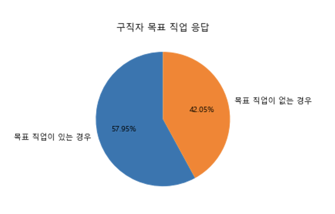
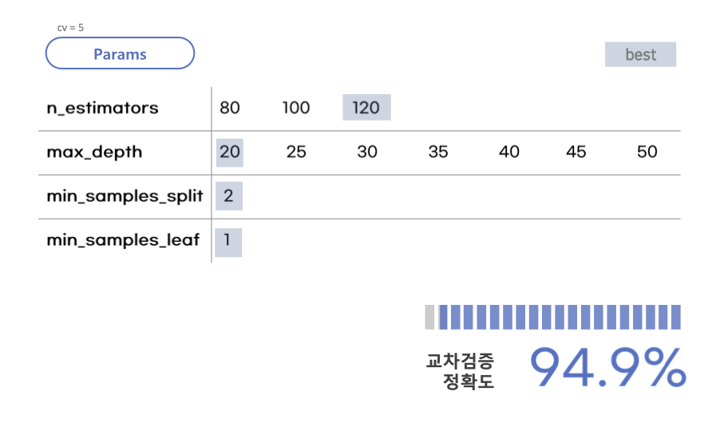

__본 프로젝트는 팀 활동으로 진행 되었고, 프로젝트 상에서 제가 기여한 부분을 중심으로 작성했습니다.__

#
## ⛳️ &nbsp;프로젝트 배경 및 목표
#  

대졸자 집단의 실업률이 높은 상황. 해당 그래프를 보면 2019년 대졸자의 취업비율은 73.8%에서 2020년 조사 당시 66.4%로 하락한 모습을 볼 수 있습니다.
   


이런 청년층 취업난의 심화에 한국고용정보원은 위와 같은 8개의 원인을 제시했습니다. 이번 프로젝트에서 저희가 주목한 것은 7번 대졸자 노동시장에 대한 잘못된 정보와 8번 구직의욕 상실자인 청년 NEET의 증가입니다.
그래서 이번 프로젝트를 통해 대졸자 구직에 영향을 미치는 요소들은 어떤 것이 있는지 알아보고 구직자 상황을 반영한 정보를 제공하고자 합니다.
   

### 기획 목표
1. 취업 여부를 결정하는 변수 알아보기
2. 종사상 지위 구분(정규직, 비정규직, 프리랜서 등)을 결정하는 변수 알아보기
3. 기업체 구분(국내 사기업, 공기업, 외국계 기업 등)을 결정하는 변수 알아보기

   


#   


---

## 📄  &nbsp;데이터 

### 대졸자 직업이동경로조사
> GOMS : Graduates Occupational Mobility Survey
  
[GOMS 조사개요](https://survey.keis.or.kr/goms/goms01.jsp)
  
  
전국의 전문대학 및 대학교 졸업자의 3~4%를 선정하여 대학 졸업자의 경력개발 및 직업(직장) 이동경로를 조사한 내용입니다.

- [데이터(2016~2018)](https://survey.keis.or.kr/goms/gomsdownload/List.jsp)
   
  
  
---

## 📊  &nbsp;데이터 전처리 및 시각화

[전처리.ipynb](https://github.com/mungdo/zero_false_one_true/blob/main/%EC%A0%84%EC%B2%98%EB%A6%AC/1%EC%B0%A8%20%EC%A0%84%EC%B2%98%EB%A6%AC/%EC%A0%84%EC%B2%98%EB%A6%AC.ipynb)
  
### 1. 데이터 확인
#
1. 전체 문답 중 주관적인 문답 요소나 응답이 거의 없는 항목 전체 제거
2. 2016, 2017, 2018년 모두 동일한 카테고리를 사용했는지 확인하기
3. null값 확인

### 2. 칼럼별로 전처리
#
1. 연령 소수점 제거(내림)
2. target값인 취업여부 : 취업(1), 미취업(0)
3. 설문 내용에 응답하지 않은 경우와 모르는 경우 전체 0으로 수정.
- 같은 이유로 NaN값 0으로 수정
4. 비슷한 내용의 설문 문답 하나로 맞추기, 동일한 내용을 묻는 세부 문답에 대해서는 필요에 따라 제거


### 3. 시각화
# 
[시각화.ipynb](https://github.com/mungdo/zero_false_one_true/blob/main/%EC%8B%9C%EA%B0%81%ED%99%94/%EA%B5%AC%EC%A7%81%EC%9E%90%EC%99%80%20%EC%B7%A8%EC%97%85%EC%9E%90%20%EC%9D%91%EB%8B%B5%20%EB%B9%84%EA%B5%90.ipynb)

1. 목표 직업의 여부 
- 구직자


- 취업자


> 구직자(약 58%), 취업자(약 60%) 모두 목표 직업이 있는 경우가 15% 이상 많았다.
2. 구직자와 취업자의 희망연봉 응답 (이상치 제거)
   
   
   
> 이상치를 제거한 이후의 희망연봉의 기술 통계량은 유사하게 나타남
> 구직자의 평균은 2,783만원이고 취업자의 평균은 2,816만원. 

3. 구직시에 중요하게 생각하는 요소
- 구직자
  

- 취업자
  

4. 전체 취업자 직장 분류 count

5. 직장 분류에 따른 근로소득

6. 구직기간 box plot (이상치 제거)


### +. 팀원들이 수행한 시각화 목록
1. 구직자/취업자 선호직업 명확성 응답 
> 선호직업에 대해서 확실하게 가지고 있었는지 정도. 매우 그렇다 <-> 전혀 그렇지 않다 (5점 척도)
2. 청년 구직활동 지원금 수령여부
3. 구직자/취업자 취업계획 및 목표의 명확성 응답
> 취업 계획시에 고려했던 요소들의 정도. 매우 준비되어 있음 <-> 전혀 준비되어 있지 않음.
4. 구직자/취업자 심리적 안정성 응답
> 심리적 안정성애 대한 요소들의 정도. 자신감 정도, 의지할 사람이 있었는가, 사회적 관심 및 지원이 있었는가.
5. 2016~2018 기간 동안 구직기간과 희망 최저 연봉의 추세
6. 취업자의 희망 연봉의 평균과 실제 연봉의 평균 비교

---

## 👩‍💻  &nbsp;데이터 학습 모델 생성

### 1. 취업 여부를 결정하는 변수 알아보기 (다른 팀원 담당 파트)
   ####
   1. 과정 요약
   - 객관적인 지표에 해당하는 독립변수 추출
   - 수치형 변수 이상치 확인 및 제거 (연령 이상치 제거)
   - Train:Validation:Test (6:2:2) with SMOTE (과적합 방지)
   - 각 모델별 기본 성능 비교 및 모델 선택
   - 메인 하이퍼파라미터 선정 후 GridSearchCV를 위한 각 성능 확인 및 범주화
   - 모델 성능 평가 및 각 변수별 영향도 확인
   ####
   2. RandomForest 이용해서 가장 영향을 많이 미치는 변수 확인
   - 하이퍼 파라미터 조정 과정
   
   - 랜덤포레스트 GridSearchCV 수행시 최적의 파라미터
   
   - 성능 평가 및 Feature Importances Top 20
   
   ####

### 2. *종사상 지위 구분(정규직, 비정규직, 프리랜서 등)을 결정하는 변수 알아보기*
   ####
   1. 과정 요약
   - 전체 항목에서 필요한 독립변수만 선별
   - 응답 데이터와 모름/무응답 데이터 분리
   - X = 종사상 지위, y = 종사상 지위를 제외한 응답 데이터로 설정 (Dataset에서 target값 분리)
   - 종사상 지위 분류 오버샘플링
   - 하이퍼 파라미터 조정 전 후 모델 비교 : 랜덤포레스트, XGBoost 적용
   - 성능 높은 모델 결과 확인 및 채택
   ####
   2. RandomForest 이용해서 결과 확인 
   - 랜덤포레스트 파라미터 조정 전 정확도 및 Feature Importances Top 20
   
   - 랜덤포레스트 GridSearchCV로 파라미터 조정
   
   - 랜덤포레스트 파라미터 조정 후 정확도 및 Feature Importances Top 20
   
   ####
   3. XGBoost 이용해서 결과 확인
   - XGBoost 파라미터 조정 전 정확도 및 Feature Importances Top 20
   
   - XGBoost GridSearchCV로 파라미터 조정
   
   - XGBoost 파라미터 조정 후 정확도 및 Feature Importances Top 20
   
   ####
   4. RandomForest VS XGBoost 비교
   
   ####
   5. 선택한 모델 (XGBoost 파라미터 조정 X)에서 중요도 높은 Features
   
   ####
   6. 선택 모델로 종사상 지위 예측 수행
   
   ####

### 3. 기업체 구분(국내 사기업, 공기업, 외국계 기업 등)을 결정하는 변수 알아보기 (다른 팀원 담당 파트)

   1. 과정 요약
   - 전체 항목에서 필요한 독립변수만 선별
   - outlier 제거
   - Dataset에서 target값 분리
   - 모델 선정을 위해 테스트 : 의사결정나무, 랜덤포레스트, XGBoost 사용
   - 하이퍼 파라미터 조정 전 후 모델 비교
   - 성능 높은 모델 결과 확인
   ####

   2. 모델별 결과
   - 하이퍼 파라미터 조정 전 Randomforest
   
   - 하이퍼 파라미터 조정 전 XGBoost
   
   - 하이퍼 파라미터 조정 후 Randomforest
   
   - 하이퍼 파라미터 조정 후 XGBoost
   
   ####
   
   3. 모델 선택
   

---

## 📢  &nbsp;발표용 PPT 및 분석 보고서 작성

[분석 보고서.pdf](https://drive.google.com/file/d/1tkLEW5AsZsFa_uHeYKGNnTBvC3m4wZjZ/view?usp=sharing)

---

## ⌨️  &nbsp;코드 공유

[프로젝트 깃허브(개인)](https://github.com/mungdo/zero_false_one_true)

---

## 🏁  &nbsp;분석을 통해 나온 결론

### 1. 취업 여부 
- 취업 여부는 취업 / 미취업으로 구분됨.
- XGB 기본 파라미터의 경우 특정 변수 Importance 값이 높은 경향이 있음. (과적합 가능성 높음)
- 랜덤포레스트 하이퍼 파라미터 튜닝 후가 F1_Score 83.7로 가장 높은 결과를 보임.
- 이 결과에 따르면 **연령, 재학 중 일자리 경험 횟수, 구직기간, 학점, 전공** 변수가 취업여부에 가장 영향을 많이 주는 것으로 분석됨.
- 연령과 일자리 횟수가 높을 수록 취업인 경우가 다수

### 2. 종사상 지위 구분
- 종사상 지위는 상용근로자 / 임시근로자 / 일용근로자 / 고용원이 있는 자영업자 / 고용원이 없는 자영업자 / 무급가족종사자로 구분됨.
- 랜덤포레스트, XGBoost 각각 파라미터 조정 전후 총 4가지의 모델 중 XGBoost 파라미터 조정하지 않은 경우를 채택함. 정확도는 77.8%
- 이 결과에 따르면 **전공분류, 학점, 학자금대출 금액, 연령**이 종사상 지위에 높은 영향을 미침.
  - 특히 특정 전공(반도체 세라믹공학, 자원, 교육학, 유아교육학)의 경우 상용근로자가 100%인 경우도 있음.
- 해당 모델을 사용해 실제 예측을 진행했을 때 predict proba(예측 확률)은 47.5~60%, 62.5~67.5%로 높다고 보기에는 어려움이 있음.

### 3. 기업체 구분
- 기업체는 내국 민간회사 / 외국 민간회사 / 공기업 / 정부기관 / 교육기관 / 연구기관 / 소속없음 / 기타로 구분됨.
- XGB의 경우 가중치를 늘려가는 방식으로 오버샘플링 진행하지 않음.
- **전공, 학위과정** 등의 변수가 취업하는 기업 유형에 가장 영향을 많이 주는 것으로 분석됨.

---

## ❗️ &nbsp;개선사항 및 느낀점

__개인적으로 느낀 미진한 부분/느낀 부분을 작성했습니다.__

1. 모델링 요소
- 대졸자의 취업에 영향을 미치는 요소로 객관적 지표로만 모델링을 실행함.
- 다른 정성적인 평가 기준인 면접, 자기소개서 등의 내용은 배제하고 진행됨.
- 따라서 참고 지표 수준밖에 되지 못했다는 한계점이 있음
- 주관적/정성적 요소의 데이터화를 추가해 개선해 나갈 여지가 있음

2. 데이터의 수집 범위와 종속 변수 세분화
- 취업 여부 분석의 경우 상용 근로자 외의 임시/일용 근로자 까지 취업자에 포함시킴.
- 종속변수로 정규직/비정규직/창업을 구분하는 등 보다 세분화할 필요가 있다고 판단됨.
- 추가로 2016~2018년 이전, 이후의 자료 분석을 통해 시간 흐름에 따른 대졸자 취업 예측 변수를 탐색할 필요가 있음.

3. 모델링 방법론과 자료의 범위
- 보다 다양화된 모델링 방법론 사용할 필요가 있음. 주로 XGBoost, 랜덤포레스트만 사용.
  - 이외의 앙상블 모형 중 배깅, 부스팅 등 다양한 방식을 추가로 활용했다면 더욱 좋은 성능의 모델을 찾을 수 있었을 것.
- 자료는 주로 인구통계학적인 특성과 졸업대학의 특성 같은 개인 노력으로 한계가 있는 부분을 많이 다루고 있음.
  - 따라서 대학생활, 취업준비, 대외활동 등의 노력으로 개선할 수 있는 부분의 정량적 데이터가 있다면 추가할 필요가 있음.


---

두번째 프로젝트는 데이터 사이언스 공부를 수강한 뒤 머신러닝을 활용해서 데이터를 분석하는 과정이었습니다.
주제 선정에 일부 어려움이 있었지만, 가치 있는 조사 데이터를 찾아냈고 덕분에 실제로 취업을 준비하는 저희들에게 도움이 될만한 내용인 "취업에 영향을 미치는 요소"를 찾아내는데 중점을 두었습니다.
어떤 방식으로 접근해야할지 어려움이 있었고 데이터 자체의 문항수가 상당했기 때문에 사용할 수 있는 데이터만 선별하다 보니 일부 주관적인 생각이 반영되었을 것 같습니다.
이 점에서 분석 과제를 발굴하고 그에 대한 객관적인 분석이 얼마나 어려운지 느낀 경험이었습니다.

다행히도 마음 맞는 팀원분들을 만나서 조언도 많이 구하고 개인적인 친분도 쌓아가면서 좋은 경험이 되었던 것 같습니다.
직접 데이터 전처리와 EDA, 앙상블 분석까지 진행하면서 개인적으로도 많이 성장했습니다. 
앞으로도 더 많은 주제로 프로젝트 경험을 쌓고 싶습니다. 읽어주셔서 감사합니다 :)


```toc
```

